## [Browser Forensics - Cryptominer](https://blueteamlabs.online/home/challenge/browser-forensics-cryptominer-aa00f593cb)  
### Description
`Our SOC alerted that there is some traffic related to crypto mining from a PC that was just joined to the network. The incident response team acted immediately, observed that the traffic is originating from browser applications. After collecting all key browser data using FTK Imager, it is your job to use the ad1 file to investigate the crypto mining activity.`  
**Tools:** BrowserHistoryViewer, FTK Imager, Manual Analysis  
**Author:** BTLO  
**Difficulty:** Easy  

### Walkthrough

#### Setup Evidence
Before starting the analysis, we need to set up the evidence item.
In this lab, I used **FTK Imager** to analyse the evidence file. However, feel free to use any other tool, such as **BrowserHistoryViewer**.  

After unzipping the folder, you’ll notice a file with the **.ad1** extension. we'll load this file into FTK Imager.  
Open **FTK Imager** > go to **File** > **Add Evidence Item**.  
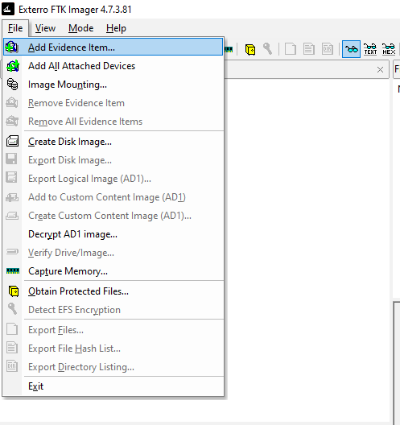  
  
Select **Image File**.  
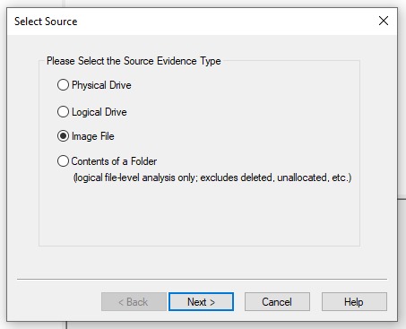  
  
Enter the path to **browserdata.ad1**.  
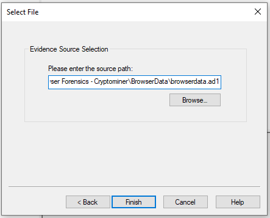  

Let's start with question 1.  
Expand the directory to the following path: `Physical Drive\\root\Users\IEUser\AppData\Local\Google\Chrome\User Data`.  
You will notice there are two profile folders: **Default** and **Profile1**.  
If you expand both folders, you’ll see they have the same folder structure.  
  
**Question 1**  
>**How many browser-profiles are present in Google Chrome?**  

Answer: 
2

  
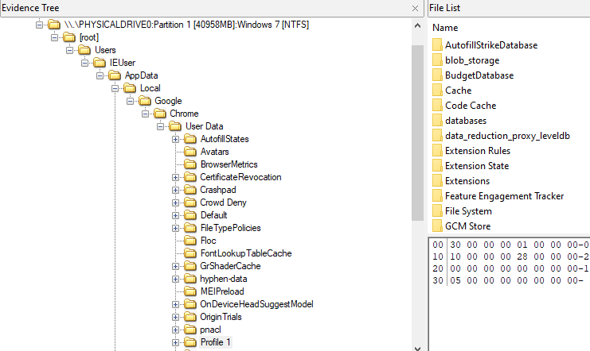  

To answer question 2, expand the **Default** profile, then navigate to the **Extensions** folder. Search for the file **manifest.json** and look for the keyword `browser theme`.  
  
**Question 2**  
>**What is the name of the browser theme installed on Google Chrome?**  

Answer: 
Earth in Space
  
  
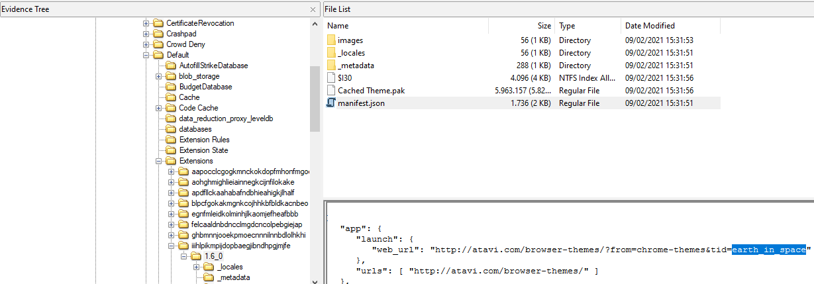  

Staying in the same **Extensions** directory, dig into the contents of another **manifest.json** file.  
You’ll discover both the cryptominer's name and its extension ID.  
Additionally, this file also contains the answer to question 4.  
  
**Question 3**  
>**Identify the Extension ID and Extension Name of the cryptominer**  

Answer: 
egnfmleidkolminhjlkaomjefheafbbb, DFP Cryptocurrency Miner

  
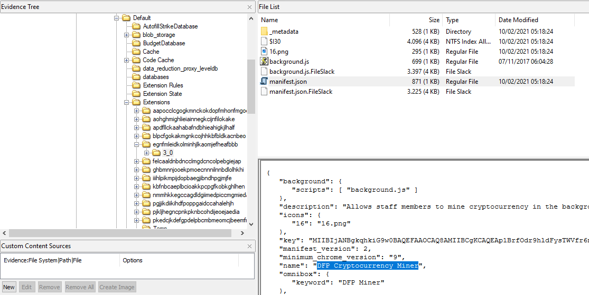  

**Question 4**  
>**What is the description text of this extension?**  

Answer: 
Allows staff members to mine cryptocurrency in the background of their web browser

  
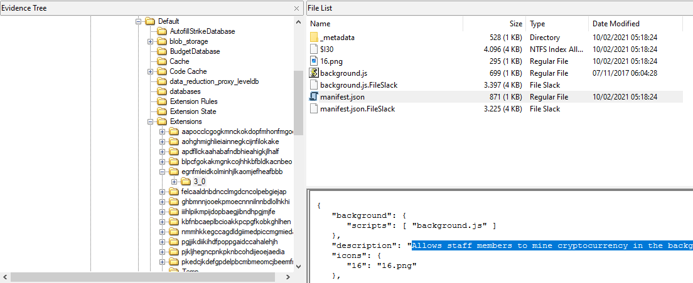  

From the same file, you can find the name of the script being executed.  
Open that script file to uncover the name of the Javascript web miner being used.  
  
**Question 5**  
>**What is the name of the specific javascript web miner used in the browser extension?**  

Answer: 
crypto-loot
  
  
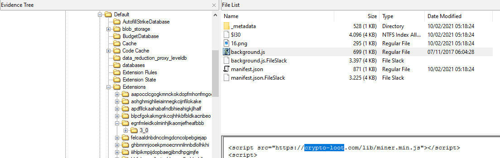  

In the same script, you’ll notice a function that uses the mining library to set the **hashes per second**.  
  
**Question 6**  
>**How many hashes is the crypto miner calculating per second?**  

Answer: 
20

  
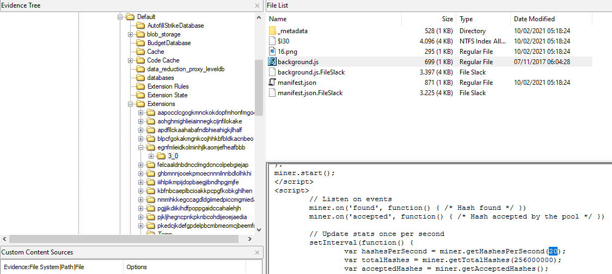  

In the same script file, you'll also find a public key associated with the cryptomining activity.  
  
**Question 7**  
>**What is the public key associated with this mining activity?**  

Answer: 
b23efb4650150d5bc5b2de6f05267272cada06d985a0

  
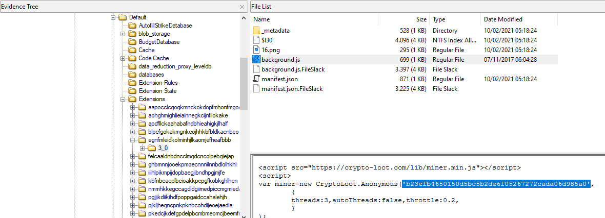  

For the final question, use your **Google Dorking** skills to search for the official Twitter page of the JavaScript web miner.  
  
**Question 8**  
>**What is the URL of the official Twitter page of the javascript web miner?**  

Answer: 
twitter.com/CryptoLootMiner

  
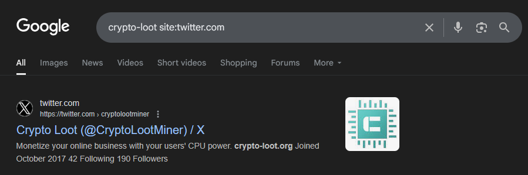  
