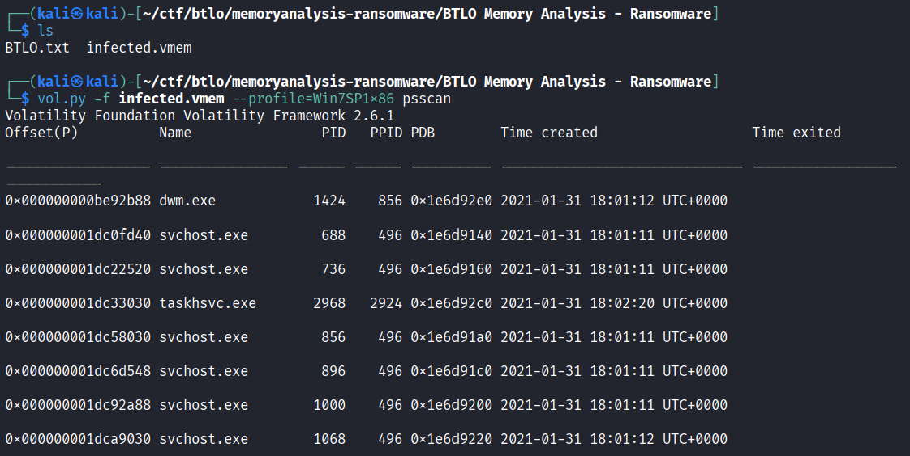
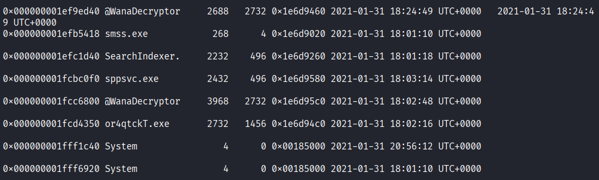
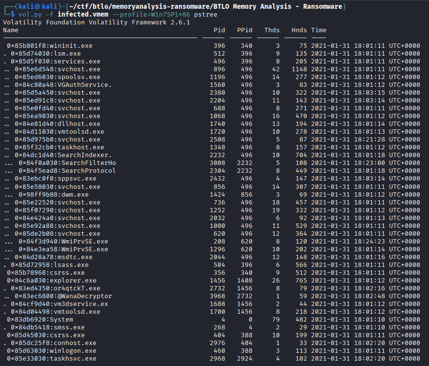
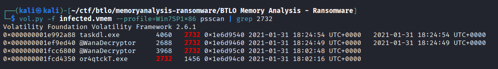
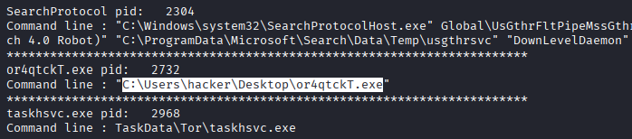
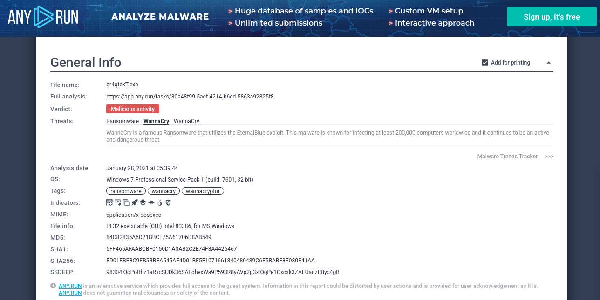
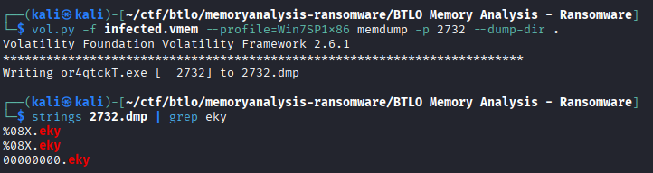

## [Memory Analysis - Ransomware](https://blueteamlabs.online/home/challenge/memory-analysis-ransomware-7da6c9244d)
### Description
`The Account Executive called the SOC earlier and sounds very frustrated and angry. He stated he can’t access any files on his computer and keeps receiving a pop-up stating that his files have been encrypted. You disconnected the computer from the network and extracted the memory dump of his machine and started analyzing it with Volatility. Continue your investigation to uncover how the ransomware works and how to stop it!`  
  
**Tools:** Volatility  
**Author:** BTLO      
**Difficulty:** Medium  

### Walkthrough

**Question 1**  
>**Run “vol.py -f infected.vmem --profile=Win7SP1x86 psscan” that will list all processes. What is the name of the suspicious process?**

Run the command using Volatility version 2:  
`vol.py -f infected.vmem --profile=Win7SP1x86 psscan`
  
  
  
Scroll down through the output and you will notice a suspicious process that starts with the @ character.  

  
  

Answer: 
@WanaDecryptor
   

**Question 2**  
>**What is the parent process ID for the suspicious process?**

From the previous output, locate the Parent Process ID (PPID). The PPID appears in the fourth column.  
  

Answer: 
2732
   

**Question 3**  
>**What is the initial malicious executable that created this process?**

To understand how the malicious executable spawned its processes, run the **pstree** plugin:  
`vol.py -f infected.vmem --profile=Win7SP1x86 pstree`
  
  
  

Answer: 
or4qtckT.exe
   

**Question 4**  
>**If you drill down on the suspicious PID (vol.py -f infected.vmem --profile=Win7SP1x86 psscan | grep (PIDhere)), find the process used to delete files**

Using the PID of the malicious executable, run the following command:  
`vol.py -f infected.vmem --profile=Win7SP1x86 psscan | grep 2732`  
  
  
    

Answer: 
taskdl.exe
   

**Question 5**  
>**Find the path where the malicious file was first executed**

Use the **cmdline** plugin to identify the execution path from the command line:  
`vol.py -f infected.vmem --profile=Win7SP1x86 cmdline`
  
  
  

Answer: 
C:\Users\hacker\Desktop\or4qtckT.exe
  

**Question 6**  
>**Can you identify what ransomware it is? (Do your research!)**

Based on the discovered executable names, we can research the ransomware online. Searching platforms such as **Any.Run** or other malware analysis sources reveals the ransomware family:    
  
  
  

Answer: 
wannacry
  

**Question 7**  
>**What is the filename for the file with the ransomware public key that was used to encrypt the private key? (.eky extension)**

First, dump the memory of the malicious process using its PID:  
`vol.py -f infected.vmem --profile=Win7SP1x86 memdump -p <PID> --dump-dir .`  

Then, use **strings** and **grep** to search for files with the **.eky** extension.  

  
  

Answer: 
00000000.eky
  
