## [Network Analysis - Web Shell](https://blueteamlabs.online/home/challenge/network-analysis-web-shell-d4d3a2821b)  
### Description
`The SOC received an alert in their SIEM for ‘Local to Local Port Scanning’ where an internal private IP began scanning another internal system.`  
**Tools:** Wireshark, TCPDump, TShark  
**Author:** BTLO  
**Difficulty:** Easy  

### Walkthrough
You'll receive a PCAP file, which you can analyse using Wireshark, tcpdump, or tshark. In this challenge, I used Wireshark as the tool for analysing the PCAP file.

When analysing a network, inspecting network conversations is a good starting point. You can do this by navigating to **Statistics** -> **Conversation**. I began by examining the number of packets in the IPv4 section. A large number of packets can indicate an intrusion or attack. However, we need to confirm whether the attack involves port scanning activity.  

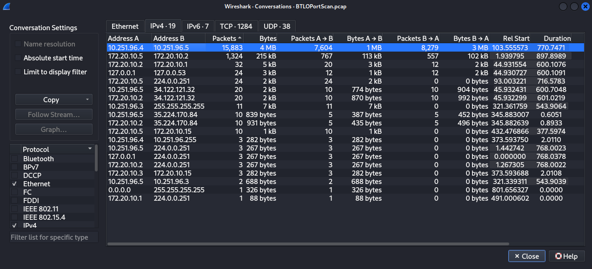  

Going to the TCP section, we can see that the IP address `10.251.96.41` is conducting a port scan, as it is attempting to scan all ports on another IP address.  

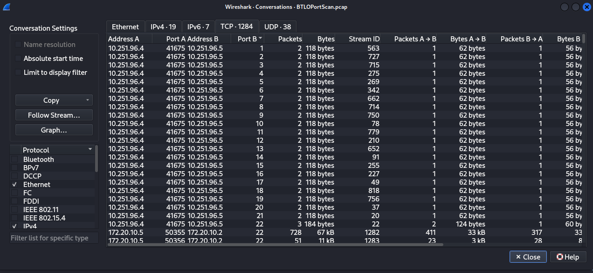  

**Question 1**  
>**What is the IP responsible for conducting the port scan activity?**  

Answer: 
10.251.96.4
  

Using the TCP conversations, we can sort **Port B** in both ascending and descending order to identify the first and last ports scanned.  

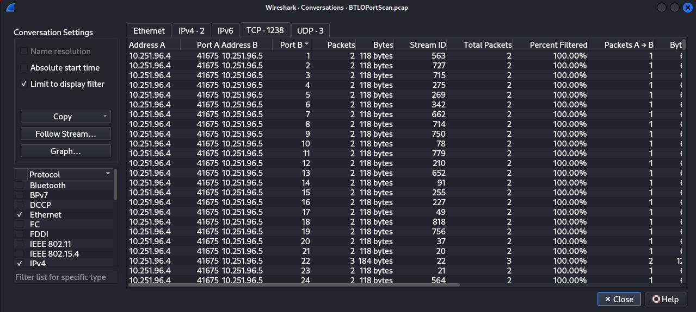
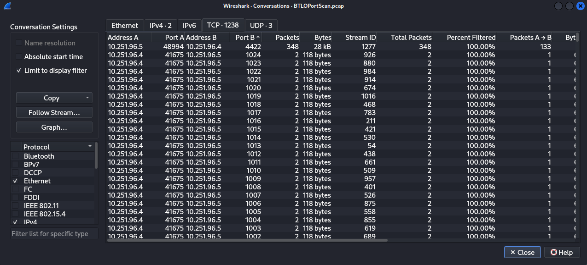  

**Question 2**  
>**What is the port range scanned by the suspicious host?**  

Answer: 
1-1024
  

We can filter for `ip.src==10.251.96.4` to determine the type of port scan. A large number of SYN packets sent to various ports indicates that the scan is a TCP SYN scan. To confirm this, you can add `tcp.flags.syn == 1 and tcp.flags.ack == 0` to the filter.    

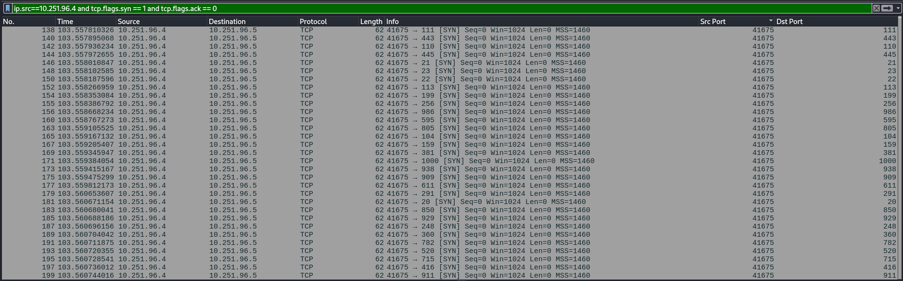  

**Question 3**  
>**What is the type of port scan conducted?**  

Answer: 
TCP SYN
  

To identify the tools used by the attacker, we can check the **User-Agent** field, which defines the tool. Using the filter `ip.dst == 10.251.96.5 && http.user_agent`, we can view the HTTP packets received by the target IP address. A large number of HTTP GET requests will be visible. By inspecting one of these packets, we can determine the suspicious tool being used.  

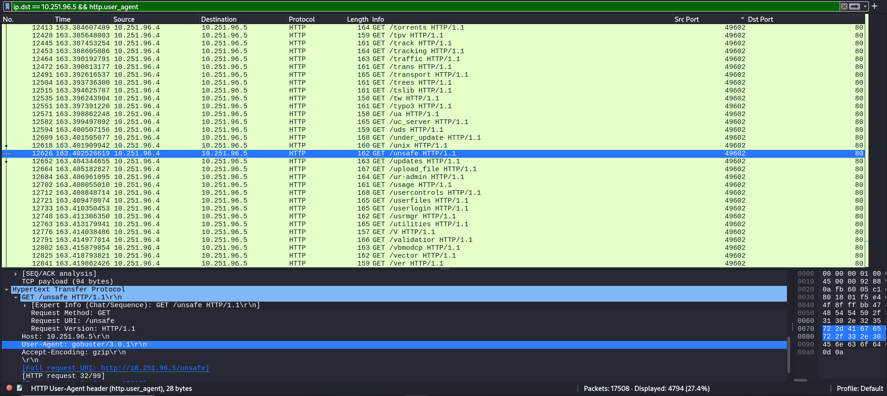  

For the second tool, look for an unusual URI in the **Info** column and then check the **User-Agent** field again to identify the tool used.  

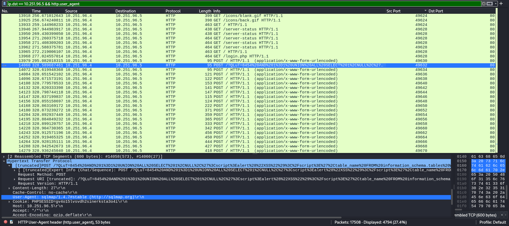  

**Question 4**  
>**Two more tools were used to perform reconnaissance against open ports, what were they?**  

Answer: 
Gobuster 3.0.1, sqlmap 1.4.7
  

Information sent to a webpage uses the HTTP POST request method. Therefore, we can filter the network traffic using `http.request.method==POST`. Scroll down until you find `/upload.php` and check the `Referer` field—this indicates the webpage where the attacker uploaded a file.  

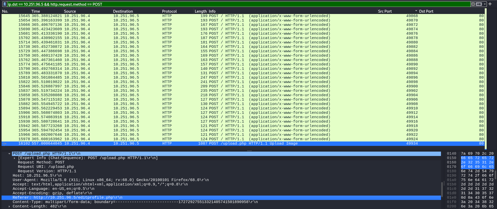  

**Question 5**  
>**What is the name of the php file through which the attacker uploaded a web shell?**  

Answer: 
Editprofile.php
  

Follow the HTTP stream, and you will find the filename of the uploaded file. This file is likely a web shell used by the attacker, as it contains injected commands.  

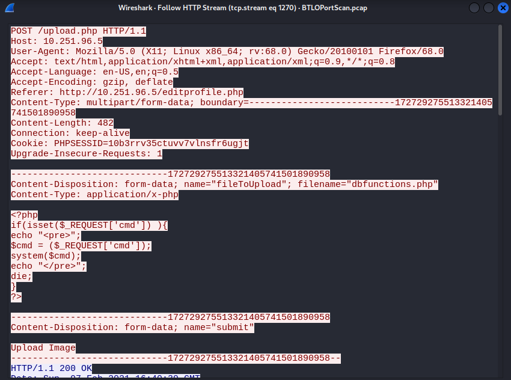  

**Question 6**  
>**What is the name of the web shell that the attacker uploaded?**  

Answer: 
Dbfunctions.php
  

The content of the file includes a request for a parameter to be set, allowing the execution of commands.  

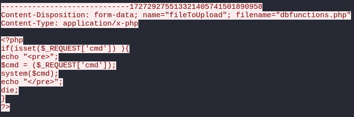  

**Question 7**  
>**What is the parameter used in the web shell for executing commands?**  

Answer: 
cmd
  

We know that the attacker has uploaded a file containing a web shell. To execute commands, the attacker must access the URL with the malicious file path. We can filter the traffic using  `ip.src==10.251.96.4 && http.request.method==GET` to identify the HTTP GET requests made by the attacker. This will reveal the first command being executed.  

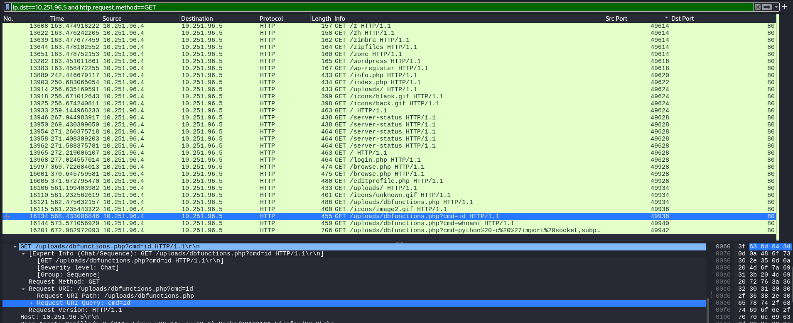  

**Question 8**  
>**What is the first command executed by the attacker?**  

Answer: 
id
  

Then, follow the HTTP stream of the third command to view the full URI of the Python script. We need to understand the script and search through Google to determine the type of shell connection.  

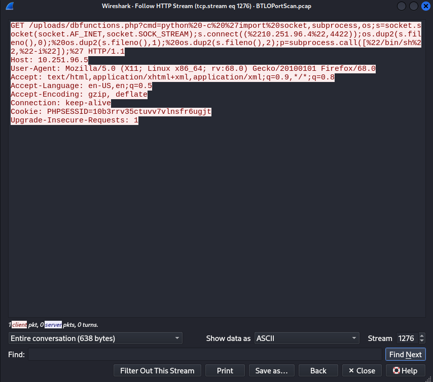  

**Question 9**  
>**What is the type of shell connection the attacker obtains through command execution?**  

Answer: 
reverse
  

The port used in the shell connection is located inside **s.connect**, following this format: `s.connect((IP address, Port))`.

**Question 10**  
>**What is the port he uses for the shell connection?**  

Answer: 
4422
  
