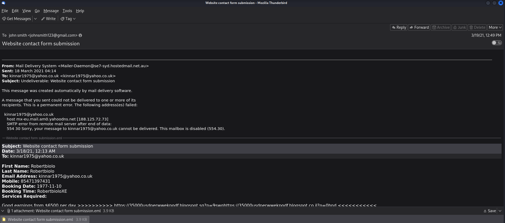
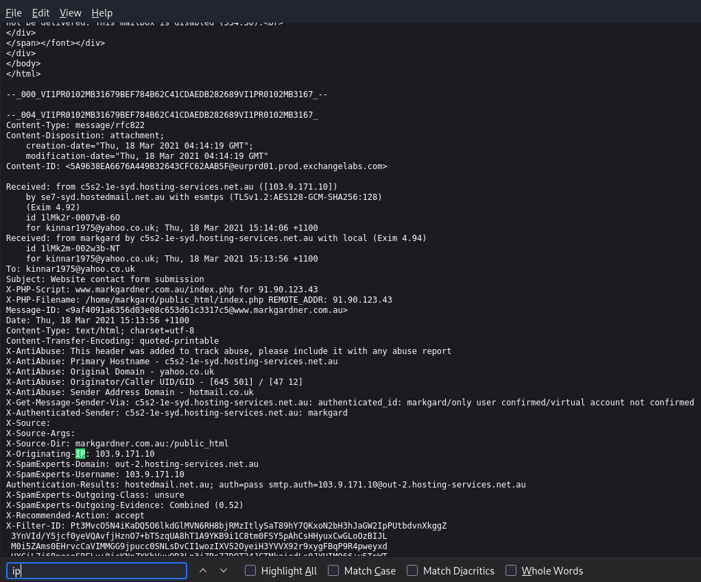
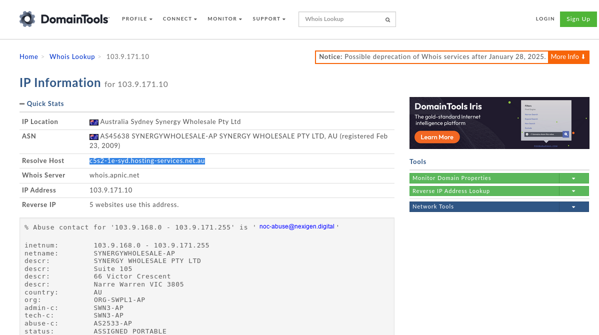
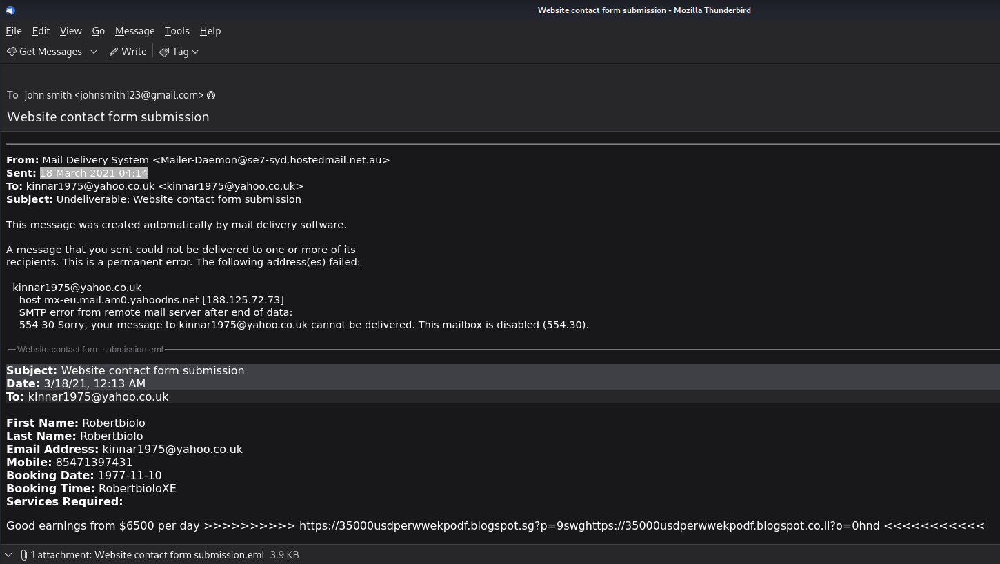
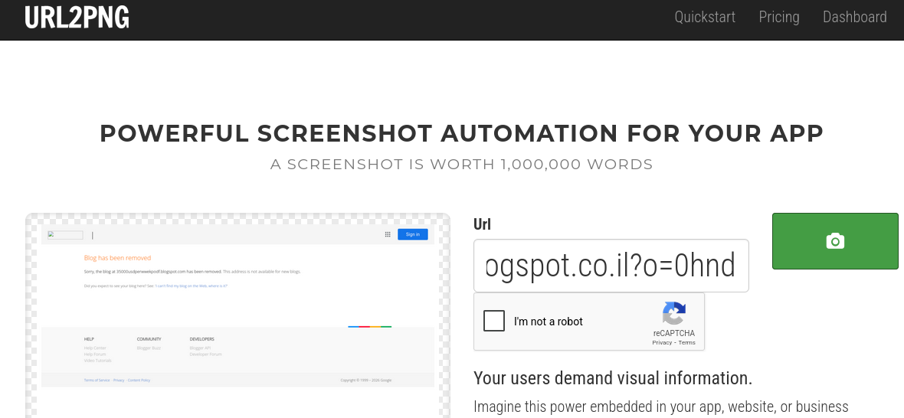

## [Phishing Analysis](https://blueteamlabs.online/home/challenge/phishing-analysis-f92ef500ce)
### Description
`A user has received a phishing email and forwarded it to the SOC. Can you investigate the email and attachment to collect useful artifacts?`  
  
**Tools:** Text Editor, Mozilla Thunderbird, URL2PNG, WHOis  
**Author:** BTLO      
**Difficulty:** Easy  

### Walkthrough
First, extract the provided file. You will receive a file with an `.eml` extension, which is an email file format. The first step is to open this file using an email client such as **Mozilla Thunderbird**, a commonly used email application on Linux.  
Once the email is opened, we can extract a large amount of information from this single piece of email evidence.  
  
  
  
The answers to **Question 1 to 3** can be found directly in the email headers shown above. Simply check the **Sent**, **To**, and **Subject** fields.  
  
**Question 1**  
>**Who is the primary recipient of this email?**  

Answer: 
kinnar1975@yahoo.co.uk
  
  
**Question 2**  
>**What is the subject of this email?**  

Answer: 
Undeliverable: Website contact form submission
  
  
**Question 3**  
>**What is the date and time the email was sent?**  

Answer: 
18 March 2021 04:14
  
  
**Question 4** is slightly more challenging for beginners, as it requires digging deeper into the email’s raw data. To do this, right-click on the email and select **View Page Source**. Then, use the find function (`Ctrl + F`) and search for the keyword **ip** to locate the originating IP address.  
  
  
  
**Question 4**  
>**What is the Originating IP?**  

Answer: 
103.9.171.10
  
  
Using the IP address identified in Question 4, we can now determine the resolved host by performing a reverse DNS lookup. This can be done using **whois.domaintools.com**.  
  
  
  
**Question 5**  
>**Perform reverse DNS on this IP address, what is the resolved host? (whois.domaintools.com)**  

Answer: 
c5s2-1e-syd.hosting-services.net.au
  
  
Next, return to the email view. At the bottom of the email, you can see an attachment. You can refer back to the first image for its location.  
  
**Question 6**  
>**What is the name of the attached file?**  

Answer: 
Website contact form submission.eml
  
  
Inspecting the contents of the attachment reveals a **suspicious URL** embedded within the email content.  
  
  

>[!NOTE]
>The URL below has been defanged. Please re-fang the URL in your answer. You may use CyberChef to do this.  

**Question 7**  
>**What is the URL found inside the attachment?**  

Answer: 
hxxps://35000usdperwwekpodf[.]blogspot[.]sg?p=9swghxxps://35000usdperwwekpodf[.]blogspot[.]co[.]il?o=0hnd
  
  
The hint for **Question 8** can be seen from the domain name in the URL. It points to a very popular free webpage hosting platform..  
  
**Question 8**  
>**What service is this webpage hosted on?**  

Answer: 
blogspot
  
  
To answer **Question 9**, submit the suspicious URL from Question 7 to the **URL2PNG** website. This tool generates a screenshot of the webpage, allowing you to view the page title even if the site is no longer accessible.  
  
  
  
**Question 9**  
>**Using URL2PNG, what is the heading text on this page? (Doesn't matter if the page has been taken down!)**  

Answer: 
Blog has been removed
  
