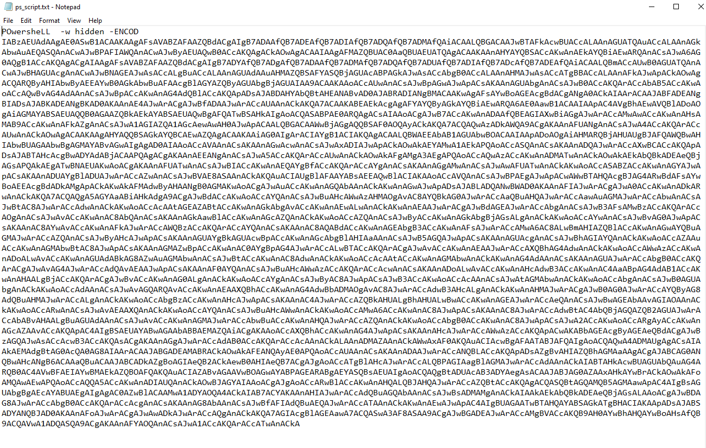
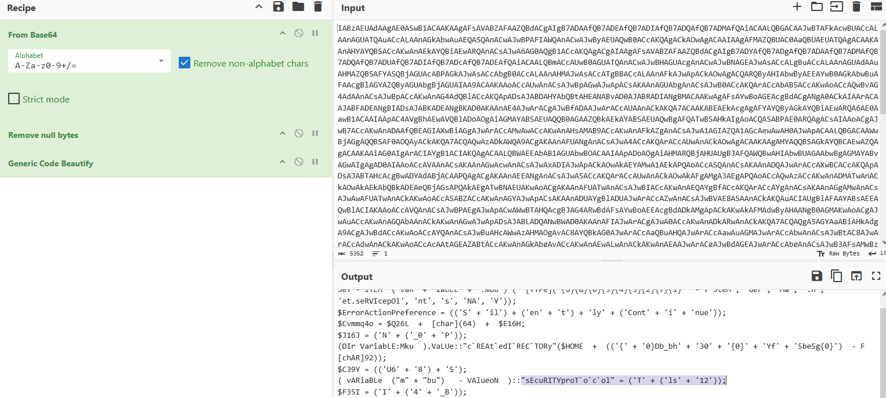
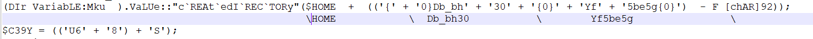
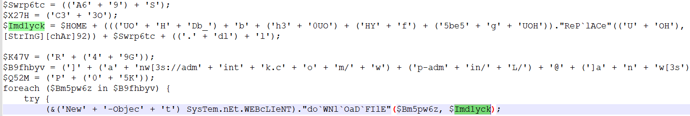
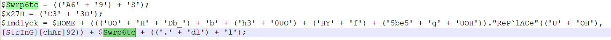
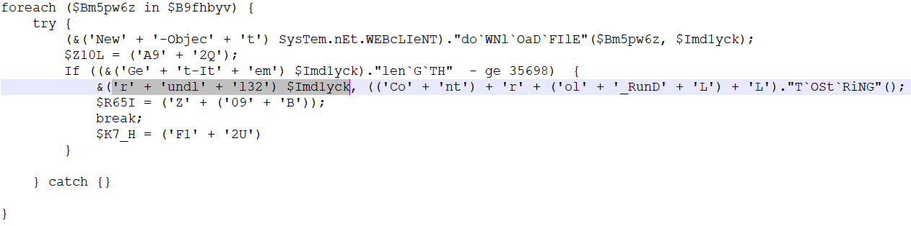
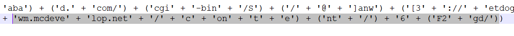
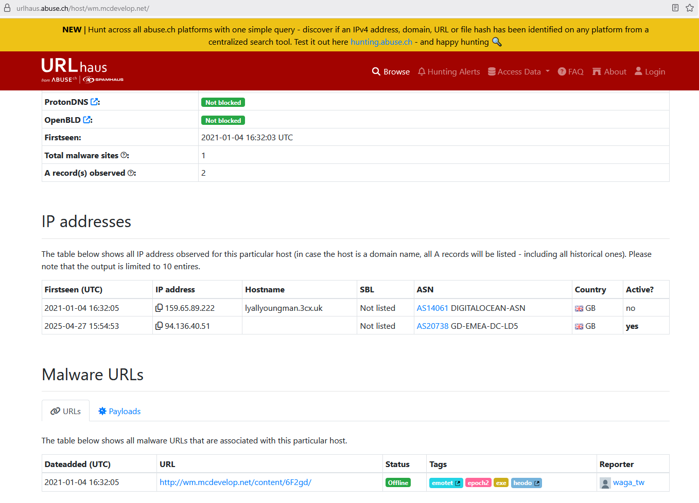

## [Malicious PowerShell Analysis](https://blueteamlabs.online/home/challenge/malicious-powershell-analysis-bf6b52faef)  
### Description
`Recently the networks of a large company named GothamLegend were compromised after an employee opened a phishing email containing malware. The damage caused was critical and resulted in business-wide disruption. GothamLegend had to reach out to a third-party incident response team to assist with the investigation. You are a member of the IR team - all you have is an encoded Powershell script. Can you decode it and identify what malware is responsible for this attack?`  
**Tools:** Text Editor, CyberChef  
**Author:** BTLO  
**Difficulty:** Medium  

### Walkthrough
We will receive a ZIP file containing a folder with two TXT files. First, extract the ZIP file using any unzip tool or command with the password **btlo**. Then, open **ps_script.txt** to start analysing the PowerShell script.  

  

The PowerShell script inside the file is encoded with Base64, and we need to decode it to read the script. To handle this challenge, we can use CyberChef and add **From Base64** to the **Recipe** section. I also added **Remove Null Bytes** and **Generic Code Beautify** to make the script easier to read. However, be aware that some `.` may be missing because of the **Remove Null Bytes**. For the first question, find **security protocol** string inside the decoded text.  

  

**Question 1**  
>**What security protocol is being used for the communication with a malicious domain?**  

Answer: 
tls1.2

For the next question, the directory created by the PowerShell script still appears obfuscated and cannot be easily read. However, it's actually quite simple. The script uses the `-F` format operator to replace all `{0}` placeholders with `[char]92` in ASCII, which represents the `\` character.  

  

**Question 2**  
>**What directory does the obfuscated PowerShell create? (Starting from \HOME\)**  

Answer: 
\HOME\Db_bh30\Yf5be5g\

Look for the clue **download file** to discover the download path and reveal the file name referenced in the path.  

  

  

**Question 3**  
>**What file is being downloaded (full name)?**  

Answer: 
A69S.dll

Not far from the name of the file being downloaded, we can see the tool that is used to run the `.dll` program. This tool is commonly used in Windows environments.  

  

**Question 4**  
>**What is used to execute the downloaded file?**  

Answer: 
rundll32

The URI for the next question is a very long obfuscated string. You could use the find-and-replace function for a faster and more reliable approach. Here, I am reading it manually because I thought it wouldn’t be that long.  

  

**Question 5**  
>**What is the domain name of the URI ending in ‘/6F2gd/’**  

Answer: 
wm.mcdevelop.net
  

The last question is the easiest one, in my opinion, as we just need to search the domain name from the previous question on Google to find the malware name associated with it.  

  

**Question 6**  
>**Based on the analysis of the obfuscated code, what is the name of the malware?**  

Answer: 
emotet
  
