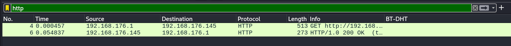
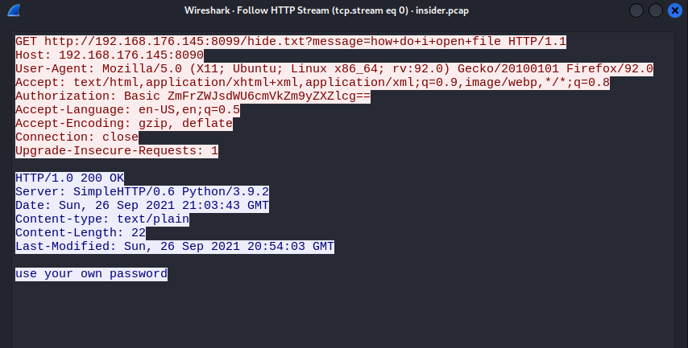
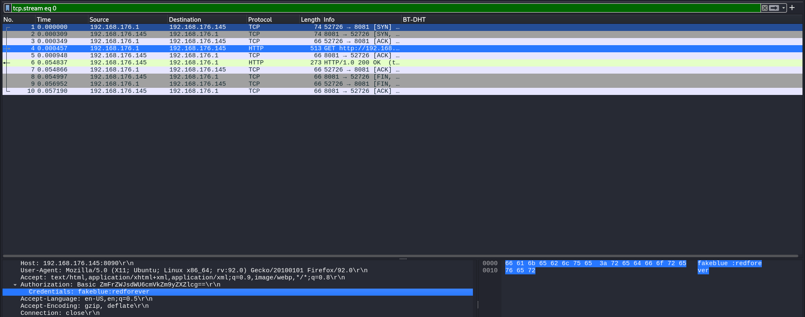
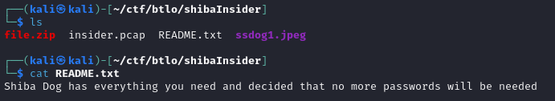
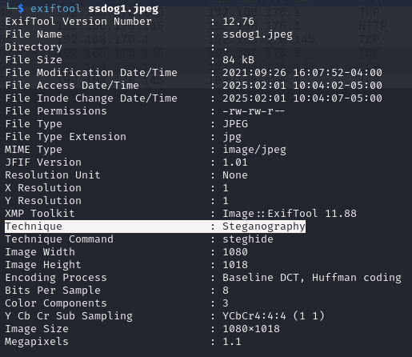
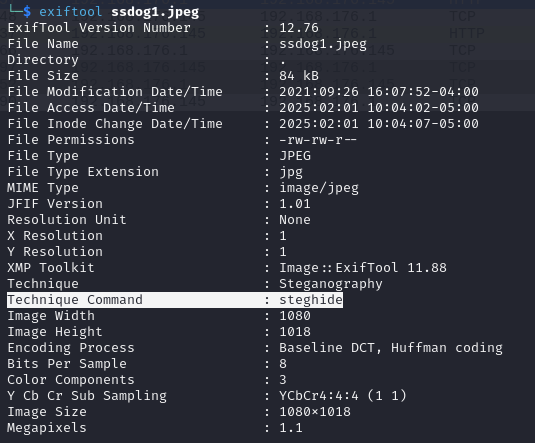
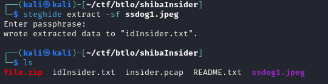
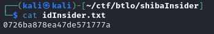
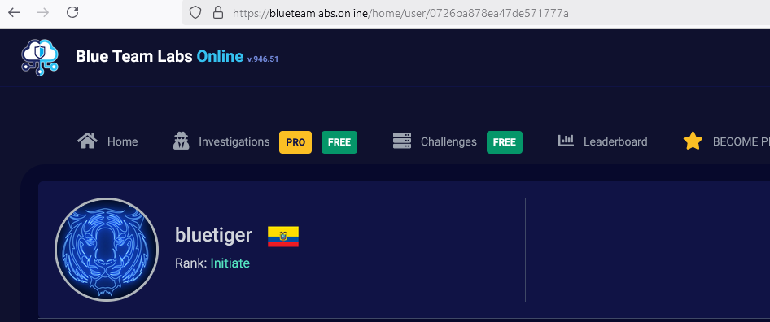

## [Shiba Insider](https://blueteamlabs.online/home/challenge/shiba-insider-5b48123711)
### Description
`Can you uncover the insider?`  
**Tools:** Wireshark, Steghide, Exiftool, Command Line  
**Author:** BTLO      
**Difficulty:** Easy  

### Walkthrough
We are given a PCAP file and a locked ZIP. The ZIP requires us to do some analysis of the PCAP file to get the password for unlocking it.  

Using Wireshark, we'll examine the PCAP file, which contains a short network capture. I noticed some readable HTTP packets.  

  

Let's follow the HTTP stream and find out what the response message is.  

>Question 1: **What is the response message obtained from the PCAP file?**  

Answer: 
use your own password
     

As the answer to question 1 suggested, we'll take a closer look at the network packets. While analysing the authorisation code, I found the credentials in the format `username:password`. This password can be used to unlock the ZIP file.  

  

>Question 2: **What is the password of the ZIP file?**  

Answer: 
redforever
  

After unzipping the file, open the README.txt—it contains the answer to the next question.  

  

>Question 3: **Will more passwords be required?**  

Answer: 
No
  

Google will be helpful for the next question. It's a popular tool for retrieving file information, especially for images.  

>Question 4: **What is the name of a widely-used tool that can be used to obtain file information?**  

Answer: 
Exiftool
  

Now, we'll use the tool from the previous question. The JPEG file will serve as the input for this tool. You'll notice an unusual name and value in the extracted information.  
  
You can run the following command to use the tool: `exiftool <file>`.

  

>Question 5: **What is the name and value of the interesting information obtained from the image file metadata?**  

Answer: 
Technique:Steganography
  

It's evident from the metadata that steganography was used to conceal data within the image.

Using the same extracted information, there's another hidden detail within the file that stands out as unusual.  

  

>Question 6: **Based on the answer from the previous question, what tool needs to be used to retrieve the information hidden in the file?**  

Answer: 
steghide
  

Next, we'll use another tool—the name of which is the answer to the previous question—to extract the hidden file from the image.  
  
Use the following command: `steghide extract -sf <file>`.  
  
The extracted file is called 'idInsider.txt', and the answer can be found inside it.  

  

  

>Question 7: **Enter the ID retrieved.**  

Answer: 
0726ba878ea47de571777a
  

The last question is a bit tricky because the name could come from anywhere. Initially, I thought the name was the same as the username we retrieved earlier, but it's not. As the challenge description mentions, 'insider', it must be related to BTLO itself. So, open your own profile and change the profile URL ID to the ID we retrieved in question 7.  

  

>Question 8: **What is the profile name of the attacker?**  

Answer: 
bluetiger
  

