## [Spectrum](https://blueteamlabs.online/home/challenge/spectrum-d6ff2a32b9)
### Description
`Scotland yard have intercepted information about one of the biggest drug deals to go down in the city of London. Someone we believe is linked to the deal was arrested. The only item they had in their possession was a USB thumb drive. Unfortunately, one of our junior analysts was unable to find anything of interest. Before we let this suspect go, we would like one of our DF experts to see if they can find anything about the deal before it goes down. Can you find out where and when the deal is expected to go down?`
  
`Note: Once you have the coordinates, you can use https://www.gps-coordinates.net/ to view the location.`  
  
**Tools:** exiftool, steghide, Audacity, fcrackzip  
**Author:** BTLO      
**Difficulty:** Easy  

### Walkthrough
First, we receive a ZIP file. After extracting it, we find a boot-sector image with a .dd extension.  

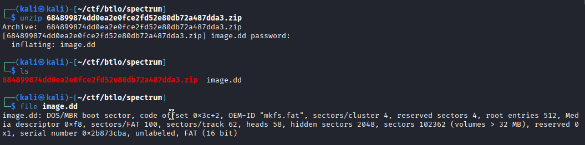  

To inspect the contents of this image, we can mount it using:  
`sudo mount -o loop image.dd /mnt`.  

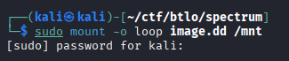  

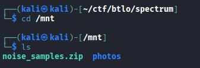  

Inside, we see a folder and a file. We’ll start by investigating the folder, which contains three photos.  

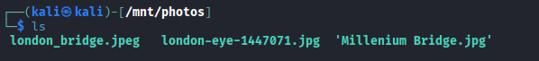  

We can use **exiftool** to check the metadata of the first photo, **london_bridge.jpeg**.  

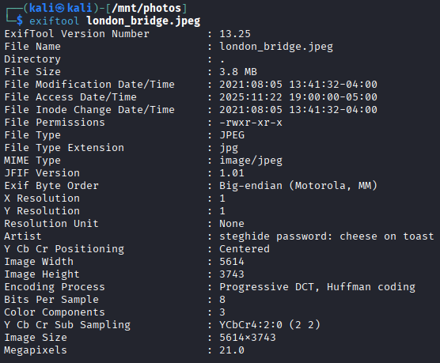  

Here, we get our next clue — the steghide password: **cheese on toast**.  

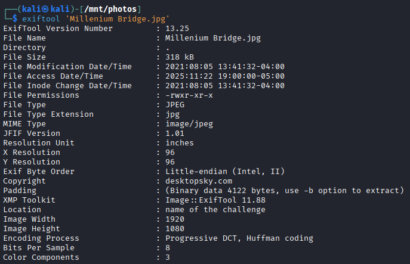  

I skipped to the last photo because the second one didn't reveal anything useful. From the final photo, we obtain another clue: **name of the challenge** -> **spectrum**.  

Now that we’re done with the photos, we move on to the ZIP file. It’s password-protected, but we can crack it using **fcrackzip** with **rockyou.txt** as the dictionary:  
`fcrackzip -u -D -p /usr/share/wordlists/rockyou.txt noise_samples.zip`.  

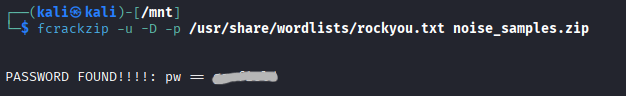  

After cracking it, unzip the file. Then, four `.wav` files will be extracted.

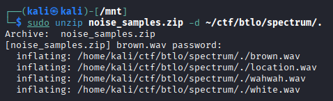  

Next, we test each file with **steghide** using the password we found earlier. One of them contains a text file with an encoded string.  

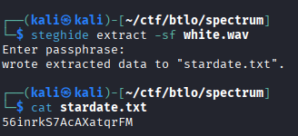  

To decode it, we will use **Cyber Chef**. The string appears to be **Base58**. After decoding, we get a time value — but it looks reversed. Reversing it from `15:01:00` to `00:10:51` gives us the answer to **Question 1**.  

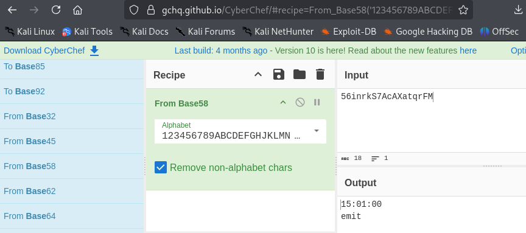  
  
**Question 1**  
>**What time is the meeting happening?**  

Answer: 
00:10:51
  

To answer Question 2, we analyze each WAV file using the second clue: **spectrum**. This suggests we should check their **spectrograms**. In **Audacity**, enable Spectrogram view by selecting **Spectrogram** from the audio track menu (click the three-dots icon next to the file name).  

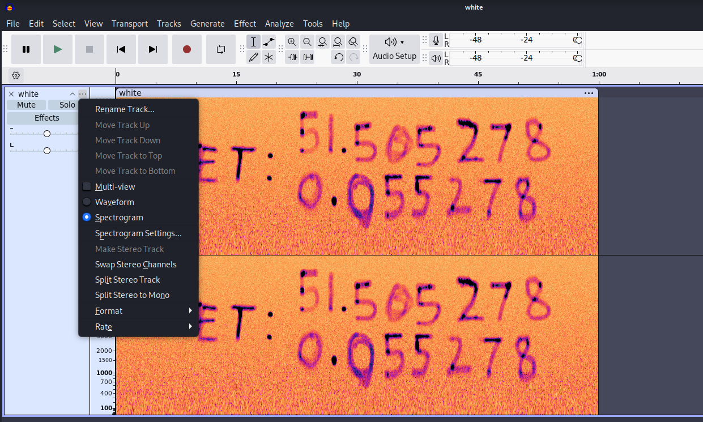  

**Question 2**  
>**What are the supposed coordinates for the deal?**  

Answer: 
51.505278, 0.055278
  

For Question 3, we simply enter the coordinates from Question 2 into **Google Maps**, which reveals the final answer.  

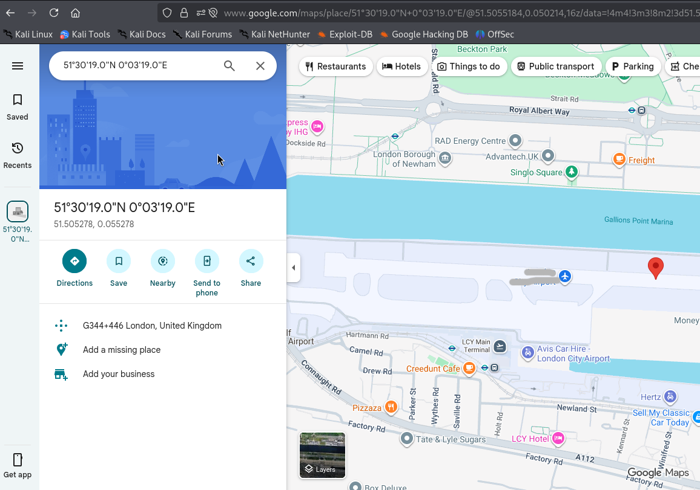  

**Question 3**  
>**Looking into these coordinates, what is the name of this location?**  

Answer: 
London City Airport
  

