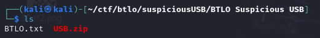
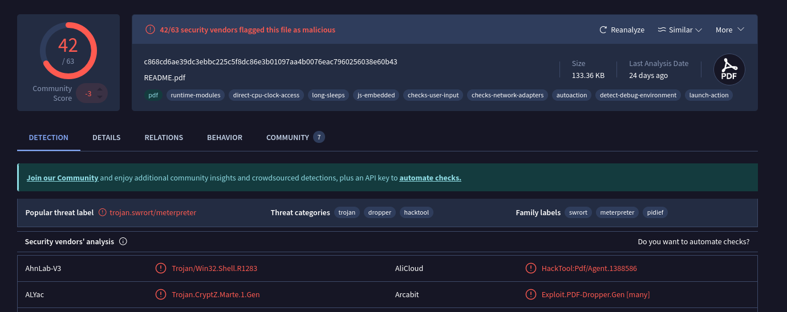
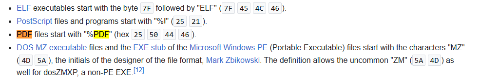
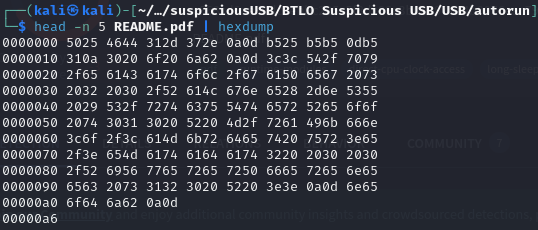
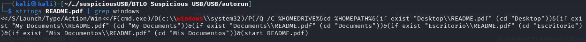
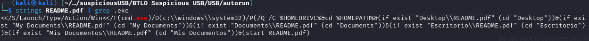
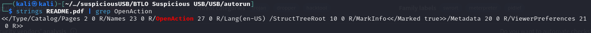

## [Suspicious USB Stick](https://blueteamlabs.online/home/challenge/suspicious-usb-stick-2f18a6b124)
### Description
`One of our clients informed us they recently suffered an employee data breach. As a startup company, they had a constrained budget allocated for security and employee training. I visited them and spoke with the relevant stakeholders. I also collected some suspicious emails and a USB drive an employee found on their premises. While I am analyzing the suspicious emails, can you check the contents on the USB drive?`  
**Tools:** VirusTotal, strings, grep, hexdump, pdfparser  
**Author:** BTLO      
**Difficulty:** Medium  

### Walkthrough
We will receive a ZIP file containing another ZIP file and a TXT file. First, extract the outer ZIP file using the **unzip** command with the password **btlo**. Once extracted, locate the inner ZIP file named `USB.zip` and extract it using the password infected. **infected**.  

  

**Q1**: **What file is the autorun.inf running?**  
To identify the file executed by autorun.inf, we can use the **strings** command. This command reveals a line labeled **open**, which specifies the file being executed. In this case, it is a PDF file. This is the answer to question 1.     

  

**Q2**: **Does the pdf file pass virustotal scan? (No malicious results returned)**  
For question 2, scan the **README.pdf** file located inside the USB folder using [VirusTotal](https://www.virustotal.com/gui/home/upload). The scan results indicate that the file did not pass, as it contains malware.  

  

**Q3**: **Does the file have the correct magic number?**  
First, search for the correct PDF magic number on Google. This will help us verify whether the **README.pdf** file has a valid PDF header or if it has been tampered with.  

  

Now, we can use the **hexdump** command to inspect the hexadecimal content of the file. Since file headers are stored in big-endian format, we need to read the hex values in reverse order. Upon verification, the magic number matches the correct PDF signature, confirming that the file has not been tampered with.  

  

**Q4**: **What OS type can the file exploit? (Linux, MacOS, Windows, etc)**  
For this question, we can determine the OS type by searching for relevant keywords using the **grep** command. By applying **grep** to different OS names within the file, I was able to match one of them, revealing the correct answer..  

  

**Q5**: **A Windows executable is mentioned in the pdf file, what is it?**  
Windows executables use the **.exe** extension. Therefore, we can search for files containing the keyword **.exe** to identify any executable files within the system.  

  

**Q6**: **How many suspicious /OpenAction elements does the file have?**  
We can use the **grep** command to find all occurrences of the **OpenAction** keyword in the file. However, to ensure we have the correct answer, we can further analyze the PDF structure using **pdfparser.py** with the following command:  
`python3 pdf-parser.py <file.pdf>`  

  
