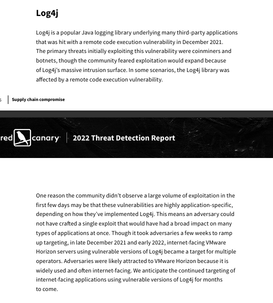
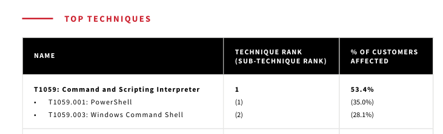
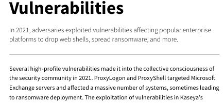
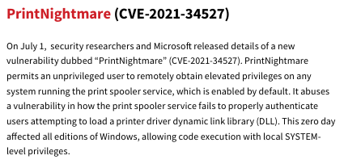
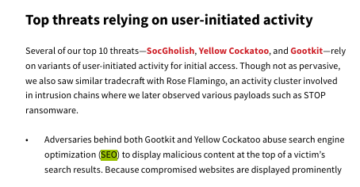
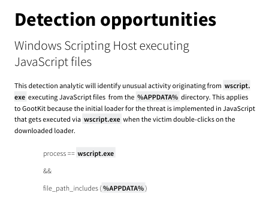
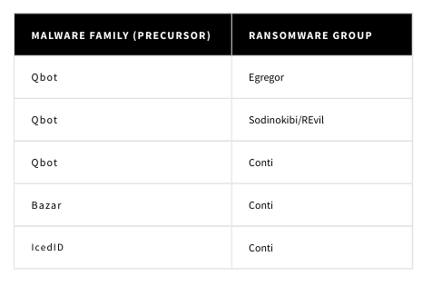
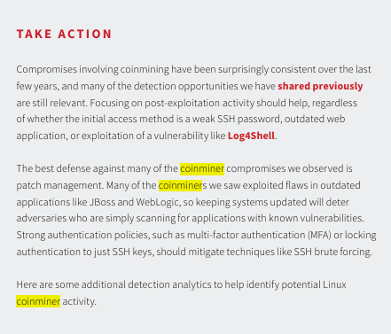
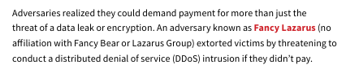
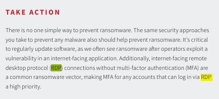

## [The Report](https://blueteamlabs.online/home/challenge/the-report-a6dd340dba)  
### Description
`You are working in a newly established SOC where still there is lot of work to do to make it a fully functional one. As part of gathering intel you were assigned a task to study a threat report released in 2022 and suggest some useful outcomes for your SOC.`  
**Tools:** PDF Reader  
**Author:** BTLO  
**Difficulty:** Easy  

### Walkthrough
This is a threat report study exercise challenge. We will review numerous threat cases from 2022. To answer all the questions, we need to identify the keywords in each question. The report is in PDF format, so a PDF reader must be installed. You can use the "Find" function (CTRL + F) to make it easier to navigate the report.  

The clue for question 1 is `supply chain attak, Java logging library`.  

  

**Task 1**  
>Question: **Name the supply chain attack related to Java logging library in the end of 2021 (Format: AttackNickname)**  

Answer: 
Log4J
  

The clue for question 2 is `effected more than 50% of the customers`.  

  

**Task 2**  
>Question: **Mention the MITRE Technique ID which effected more than 50% of the customers**  

Answer: 
T1059
  

The clue for question 3 is `vulnerabilities belonging to Exchange Servers`.  

  

**Task 3**  
>Question: **Submit the names of 2 vulnerabilities belonging to Exchange Servers (Format: VulnNickname, VulnNickname)**  

Answer: 
ProxyLogon, ProxyShell

The clue for question 4 is `CVE, zero day, RCE, SYSTEM privileges`.  

  

**Task 4**  
>Question: **Submit the CVE of the zero day vulnerability of a driver which led to RCE and gain SYSTEM privileges**  

Answer: 
CVE-2021–30116

The clue for question 5 is `adversary groups, SEO, initial access`.  

  

**Task 5**  
>Question: **Mention the 2 adversary groups that leverage SEO to gain initial access**  

Answer: 
Gootkit, Yellow Cockatoo

The clue for question 6 is `execution, Javascript files`.  

  

**Task 6**  
>Question: **In the detection rule, what should be mentioned as parent process if we are looking for execution of malicious js files [Hint: Not CMD]**  

Answer: 
wscript.exe

The clue for question 7 is `precursor, Conti`.  

  

**Task 7**  
>Question: **Ransomware gangs started using affiliate model to gain initial access. Name the precursors used by affiliates of Conti ransomware group**  

Answer: 
Qbot, Bazar, IcedID
  

The clue for question 8 is `coinminer, outdated software`.  

  

**Task 8**  
>Question: **The main target of coin miners was outdated software. Mention the 2 outdated software mentioned in the report**  

Answer: 
JBoss, WebLogic

The clue for question 9 is `threatened, DDoS, pay`.  

  

**Task 9**  
>Question: **Name the ransomware group which threatened to conduct DDoS if they didn’t pay ransom**  

Answer: 
Fancy Lazarus

The clue for question 10 is `RDP, ransomware`.  

  

**Task 10**  
>Question: **What is the security measure we need to enable for RDP connections in order to safeguard from ransomware attacks?**  

Answer: 
MFA

