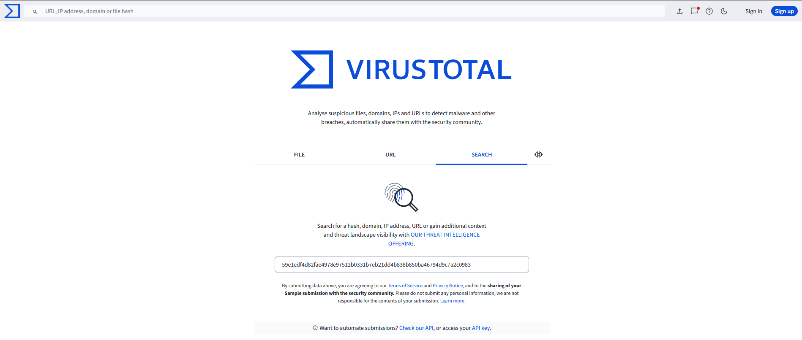
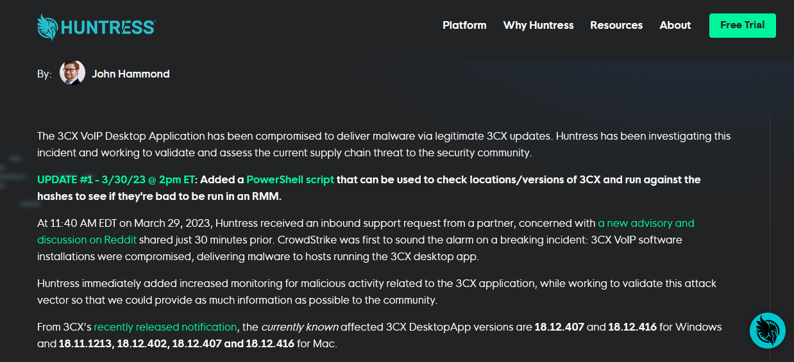
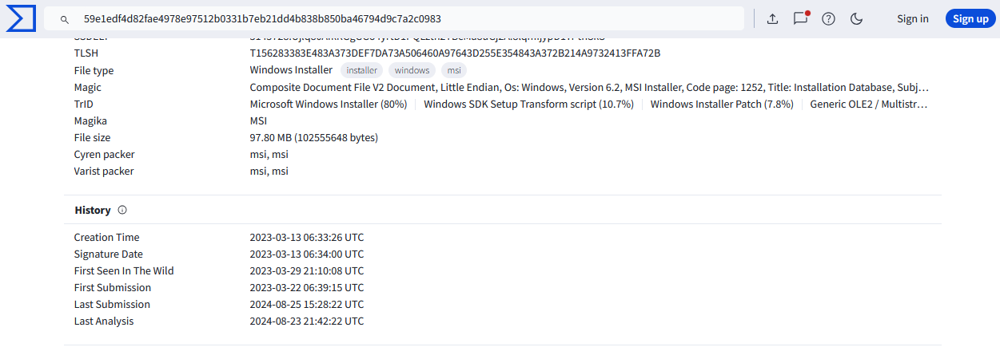
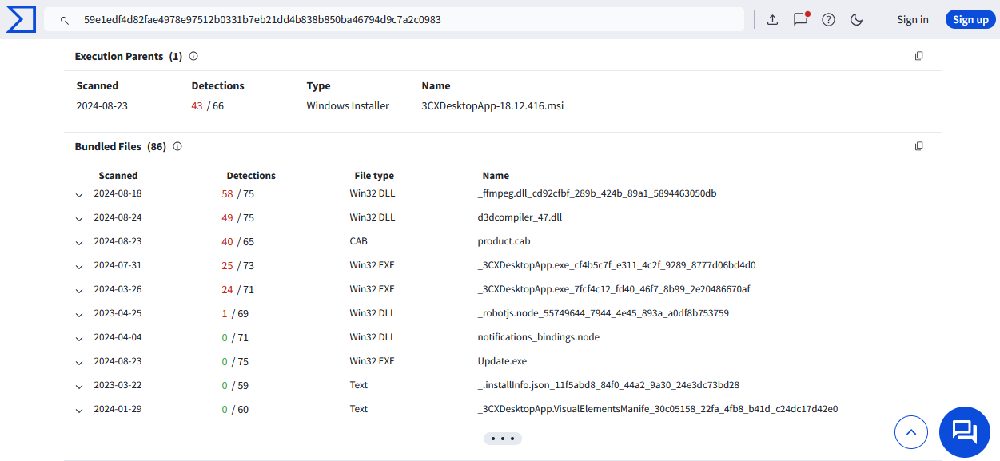
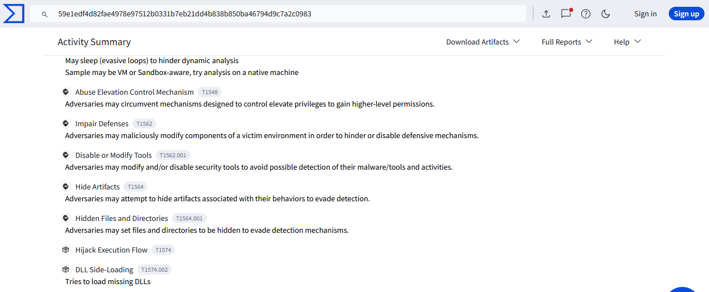
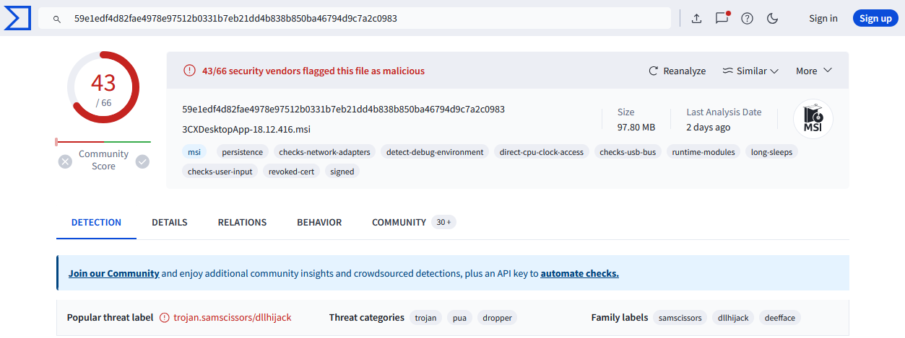
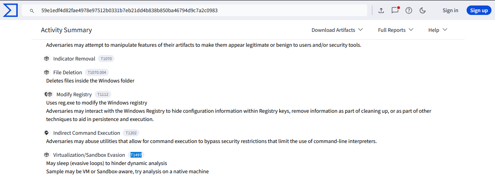
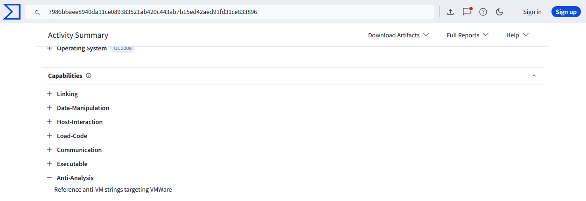
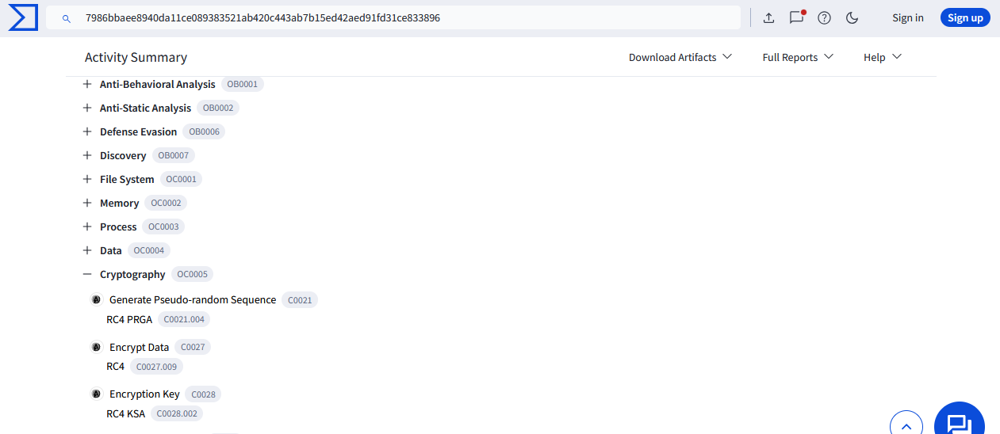
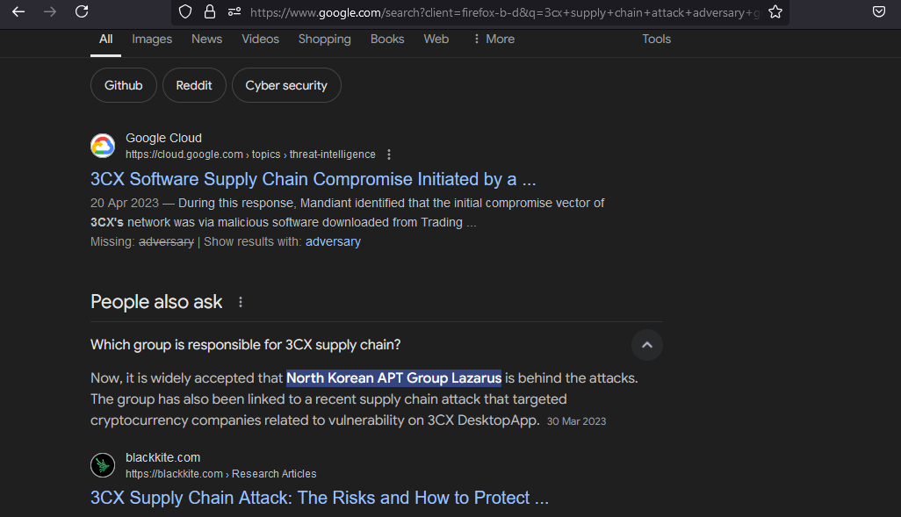

## [3CX Supply Chain](https://cyberdefenders.org/blueteam-ctf-challenges/3cx-supply-chain/)
### Description
`A large multinational corporation heavily relies on the 3CX software for phone communication, making it a critical component of their business operations. After a recent update to the 3CX Desktop App, antivirus alerts flag sporadic instances of the software being wiped from some workstations while others remain unaffected. Dismissing this as a false positive, the IT team overlooks the alerts, only to notice degraded performance and strange network traffic to unknown servers. Employees report issues with the 3CX app, and the IT security team identifies unusual communication patterns linked to recent software updates.
As the threat intelligence analyst, it's your responsibility to examine this possible supply chain attack. Your objectives are to uncover how the attackers compromised the 3CX app, identify the potential threat actor involved, and assess the overall extent of the incident.`  
**Tools:** VirusTotal, Google search  
**Author:** CyberDefenders     
**Difficulty:** Easy  

### Walkthrough  
After unzipping the lab files, you'll find a file with a .msi extension, which is a Windows Installer package. Be careful not to run it on your host environment, as it contains malware.  
There are two ways to analyse the file:
1. Find the hash value and search for it on the [VirusTotal](https://www.virustotal.com/gui/home/upload) website.  
2. Upload the file directly to the [VirusTotal](https://www.virustotal.com/gui/home/upload) website.  

I chose to find the hash value first and search for it on the VirusTotal website, as it is safer than uploading the file directly (you could accidentally double-click on it and run the malware).  
I used the `Get-FileHash .\3CXDesktopApp-18.12.416.msi -Algorithm SHA256` command in **Windows Powershell** to find the SHA256 Hash value.  
  
  

Then, insert the hash into the VirusTotal website.  

  
  
**Q1**: **Understanding the scope of the attack and identifying which versions exhibit malicious behavior is crucial for making informed decisions if these compromised versions are present in the organization. How many versions of 3CX running on Windows have been flagged as malware?**  

For question 1, I searched on Google and found a website that contains the information we need.  

  

**Q2**: **Determining the age of the malware can help assess the extent of the compromise and track the evolution of malware families and variants. What's the UTC creation time of the .msi malware?**  

The answer to this question can be found in the details of the VirusTotal analysis.  

  

**Q3**: **Executable files (.exe) are frequently used as primary or secondary malware payloads, while dynamic link libraries (.dll) often load malicious code or enhance malware functionality. Analyzing files deposited by the Microsoft Software Installer (.msi) is crucial for identifying malicious files and investigating their full potential. Which malicious DLLs were dropped by the .msi file?**  

Next, look at the relations tab, where you'll find DLL files associated with the malware.  

  

**Q4**: **Recognizing the persistence techniques used in this incident is essential for current mitigation strategies and future defense improvements. What is the MITRE sub-technique ID employed by the .msi files to load the malicious DLL?**

To find the MITRE sub-technique ID, review the behavior analysis of the malware in VirusTotal, where the answer is provided.  

  

**Q5**: **Recognizing the malware type (threat category) is essential to your investigation, as it can offer valuable insight into the possible malicious actions you'll be examining. What is the malware family of the two malicious DLLs?**

In the first section of the analysis, you’ll find clues and the answer regarding the malware family.  

  

**Q6**: **As a threat intelligence analyst conducting dynamic analysis, it's vital to understand how malware can evade detection in virtualized environments or analysis systems. This knowledge will help you effectively mitigate or address these evasive tactics. What is the MITRE ID for the virtualization/sandbox evasion techniques used by the two malicious DLLs?**  

The key clue here is the use of virtualization/sandbox evasion techniques.  

  

**Q7**: **When conducting malware analysis and reverse engineering, understanding anti-analysis techniques is vital to avoid wasting time. Which hypervisor is targeted by the anti-analysis techniques in the ffmpeg.dll file?**  

For questions 7 and 8, dive deeper into the **ffmpeg.dll** analysis. You can analyze the file by double-clicking it.  

  

**Q8**: **Identifying the cryptographic method used in malware is crucial for understanding the techniques employed to bypass defense mechanisms and execute its functions fully. What encryption algorithm is used by the ffmpeg.dll file?**

Look for the cryptography section in the **ffmpeg.dll** analysis pages.  

  

**Q9**: **As an analyst, you've recognized some TTPs involved in the incident, but identifying the APT group responsible will help you search for their usual TTPs and uncover other potential malicious activities. Which group is responsible for this attack?**  

For the last question, I found the answer by searching on Google for the malware and the threat actors involved.  

  
