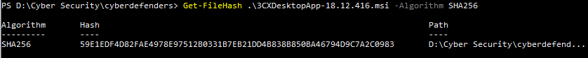

## [3CX Supply Chain](https://cyberdefenders.org/blueteam-ctf-challenges/3cx-supply-chain/)
### Description
`A large multinational corporation heavily relies on the 3CX software for phone communication, making it a critical component of their business operations. After a recent update to the 3CX Desktop App, antivirus alerts flag sporadic instances of the software being wiped from some workstations while others remain unaffected. Dismissing this as a false positive, the IT team overlooks the alerts, only to notice degraded performance and strange network traffic to unknown servers. Employees report issues with the 3CX app, and the IT security team identifies unusual communication patterns linked to recent software updates.
As the threat intelligence analyst, it's your responsibility to examine this possible supply chain attack. Your objectives are to uncover how the attackers compromised the 3CX app, identify the potential threat actor involved, and assess the overall extent of the incident.`  
**Tools:** VirusTotal, Google search  
**Author:** CyberDefenders     
**Difficulty:** Easy  

### Walkthrough  
After unzipping the lab files, you'll find a file with a .msi extension, which is a Windows Installer package. Be careful not to run it on your host environment, as it contains malware.  
There are two ways to analyse the file:
1. Find the hash value and search for it on the [VirusTotal](https://www.virustotal.com/gui/home/upload) website.  
2. Upload the file directly to the [VirusTotal](https://www.virustotal.com/gui/home/upload) website.  

I chose to find the hash value first and search for it on the VirusTotal website, as it is safer than uploading the file directly (you could accidentally double-click on it and run the malware).  
I used the `Get-FileHash .\3CXDesktopApp-18.12.416.msi -Algorithm SHA256` command in **Windows Powershell** to find the SHA256 Hash value.  
  
  

**Q1**: **Understanding the scope of the attack and identifying which versions exhibit malicious behavior is crucial for making informed decisions if these compromised versions are present in the organization. How many versions of 3CX running on Windows have been flagged as malware?**  

