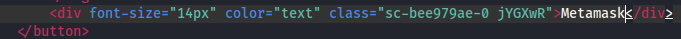
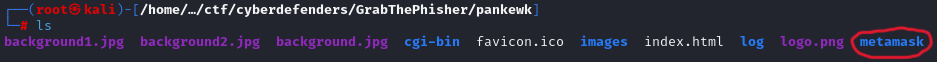
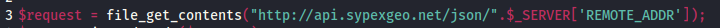
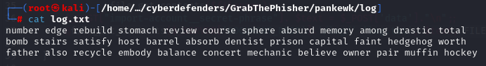
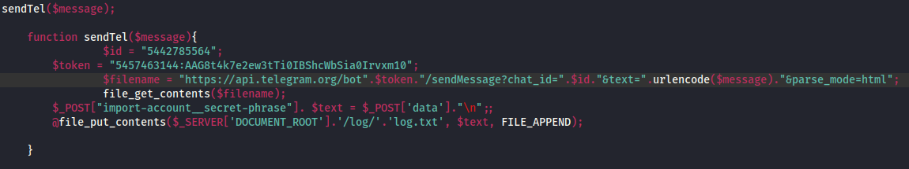
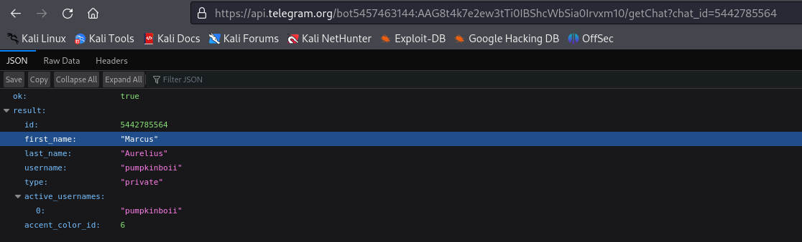

## GrabThePhisher
### Description
`An attacker compromised a server and impersonated https://pancakeswap.finance/, a decentralized exchange native to BNB Chain, to host a phishing kit at https://apankewk.soup.xyz/mainpage.php. The attacker set it as an open directory with the file name "pankewk.zip". Provided the phishing kit, you as a soc analyst are requested to analyze it and do your threat intel homework.`   
**Author:** Milann SHRESTHA     
**Difficulty:** Easy  

### Walkthrough
To initiate the lab, we must unzip the file named "c75-GrabThePhisher.zip," which has been provided, using the password: **cyberdefenders.org**.  
Initially, I explored the **index.html** file and identified various wallet options. Notably, only one wallet's name matched the folder within the uncompressed directory, named **Metamask**.  

**Q1**  
>Question: **Which wallet is used for asking the seed phrase?**   

Answer: 
Metamask

Moving on to the next question, the file containing the code for the phishing kit is clearly noticeable. With the identification of a folder bearing the wallet's suspicious name, delving deeper into this folder will uncover a file sharing the same name, effectively addressing the second question.    

**Q2**  
>Question: **What is the file name that has the code for the phishing kit?**   

Answer: 
metamask.php

The next question is straightforward; the file extension obtained from question 2 offers the solution to question 3.

**Q3**  
>Question: **In which language was the kit written?**   

Answer: 
PHP

For question 4, a deeper investigation into the file is necessary. On line 3, there is an API URL that appears suspicious. Accessing this URL in a browser reveals the victim's geolocation, indicating the service employed by the phishing kit to gather machine information.  

**Q4**  
>Question: **What service does the kit use to retrieve the victim's machine information?**   

Answer: 
Sypex Geo

Line 37 shows a function to write down something on a file. This could be a way for the attacker to collect the seed phrases. Inside the function, there is a path to the file.  

Line 37 reveals a function for writing to a file, potentially a method for the attacker to gather seed phrases. Within this function, there is a specified file path. Therefore, inspecting the file path, starting from the root file (**pankewk**) and proceeding to **/log/log.txt**. We can count the line of the phrases to answer question 5.      

**Q5**  
>Question: **How many seed phrases were already collected?**   

Answer: 
3

To answer question 6, examine the last image and write down the final phrase.  

**Q6**  
>Question: **Write down the seed phrase of the most recent phishing incident?**   

Answer: 
father also recycle embody balance concert mechanic believe owner pair muffin hockey
  

To identify the medium used for credential dumping, inspect the **sendTel**, which interacts with the Telegram API. This function indicates that Telegram is the chosen medium for credential dumping.  

**Q7**  
>Question: **Which medium had been used for credential dumping?**   

Answer: 
Telegram

The token for the Telegram channel is visible in the previous image, stored in a variable named **token**.  

**Q8**  
>Question: **What is the token for the channel?**   

Answer: 
5457463144:AAG8t4k7e2ew3tTi0IBShcWbSia0Irvxm10

Likewise, the ID is found in the last image under a variable with the same name.  

**Q9**  
>Question: **What is the chat ID of the phisher's channel?**   

Answer: 
5442785564

The next question is a bit different, but the answer is still in the same file. The phisher's allies left a message in the file, showing they are with the phisher using a nickname.  

**Q10**  
>Question: **What are the allies of the phish kit developer?**   

Answer: 
j1j1b1s@m3r0

The following question presents a challenge, requiring an understanding of Telegram API methods. You can see the methods from the documentation [here](https://core.telegram.org/bots/api#available-methods). A relevant method, such as the getChat method, can retrieve the Phish Actor's name. Formulating the URL as follows: `https://api.telegram.org/bot<Token>/getChat?chat_id=<Chat_ID>`. and inputting the token and chat ID, will get the information needed. The complete URL is provided below:  
`https://api.telegram.org/bot5457463144:AAG8t4k7e2ew3tTi0IBShcWbSia0Irvxm10/getChat?chat_id=5442785564`.  

The image below displays the response received from Telegram.  

  

**Q11**  
>Question: **What is the full name of the Phish Actor?**   

Answer: 
Marcus Aurelius

You can find the answer to the last question in the JSON response from Telegram, as shown in the image before.

**Q12**  
>Question: **What is the full name of the Phish Actor?**   

Answer: 
pumpkinboii

