## [L'espion](https://cyberdefenders.org/blueteam-ctf-challenges/lespion/)
### Description
`You, as a soc analyst, have been tasked by a client whose network was compromised and brought offline to investigate the incident and determine the attacker's identity.
Incident responders and digital forensic investigators are currently on the scene and have conducted a preliminary investigation. Their findings show that the attack originated from a single user account, probably, an insider.
Investigate the incident, find the insider, and uncover the attack actions.`   
**Tools:** sherlock, Google Maps, Google Image search  
**Author:** BushidoToken     
**Difficulty:** Easy  

### Walkthrough  
After we unzip the lab files, we'll find three files in it: **Github.txt**, **office.jpg**, and **WebCam.png**. Then, we can proceed to the first question.  

**Q1**: **File -> Github.txt: What is the API key the insider added to his GitHub repositories?**  
As mentioned in the question, we need to check inside **Github.txt**. In there, I found a link to a GitHub account. 

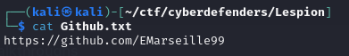  

Upon inspecting the GitHub author contributions for the year 2020, it is apparent that there are four commits within a single repository on May 24 

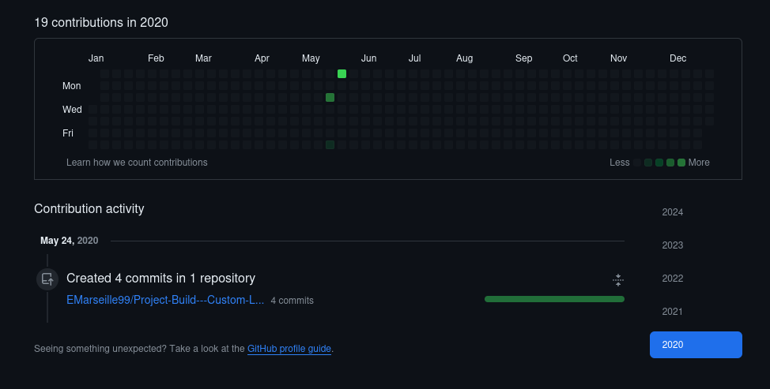  

After that, I clicked on the repository and saw that there are two files..  

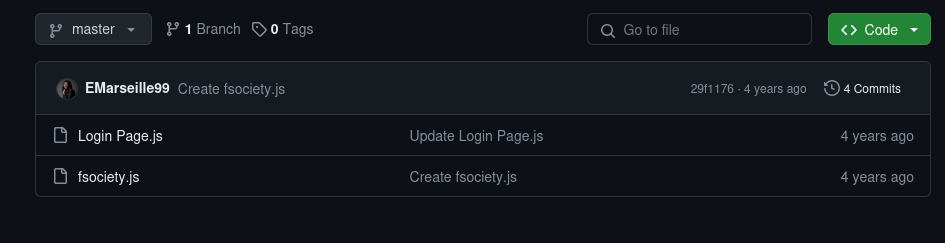  

I found the API key inside the **Login Page.js**. To be specific, it is located on the first line.

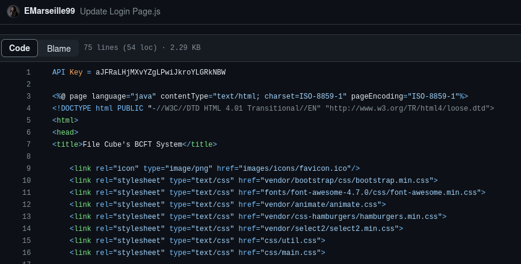

**Q2**: **File -> Github.txt: What is the plaintext password the insider added to his GitHub repositories?**  
In that same file, I came across an encrypted password. To figure it out, I used a clue from an image. The clue, explicitly stating **base64**, indicates that the password is encrypted using **base64**. Consequently, to decipher the base64-encoded password, I went to this website called [CyberChef](https://gchq.github.io/CyberChef/). Simply selecting the base64 option did the trick.

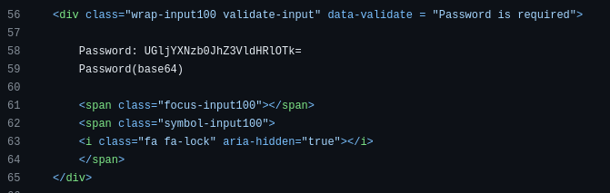  

**Q3**: **File -> Github.txt: What cryptocurrency mining tool did the insider use?**  
To discover the answer to question 3, I browsed through the author's repositories, carefully examining each one. Eventually, I stumbled upon a repository that seemed to be a tool for something. Referencing the image below, you should be able to find the answer to question 3.

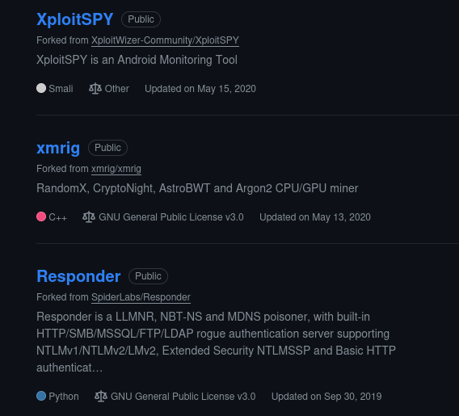  

**Q4**: **What university did the insider go to?**  
I located the university where the insider goes by checking the social media accounts they used. The answer was found on her LinkedIn profile, which I discovered by searching her username on Google.

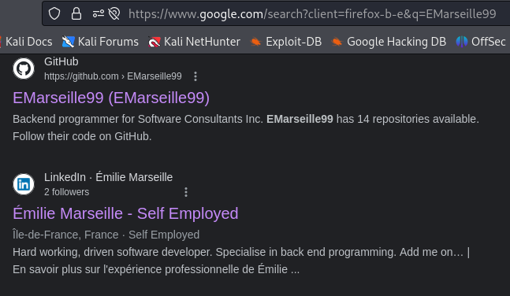  

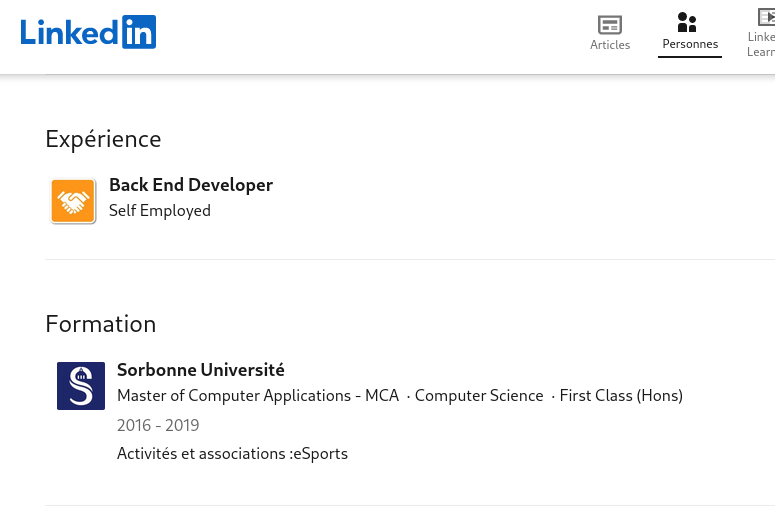  

**Q5**: **What gaming website the insider had an account on?**  
To identify the gaming website where the insider had an account, I utilized the [Username Checker](https://checkusernames.com/) website. By entering the username, I discovered that the insider had an account on one of the gaming platforms with the same username.  

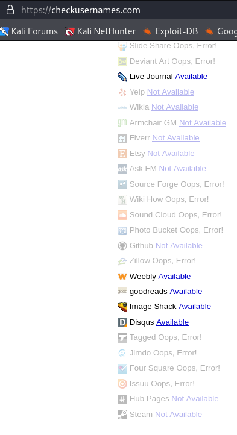

Following that, I verified it by clicking on the link associated with the gaming platform logo on the Username Checker website. It confirmed that the insider's username exists on the platform.  

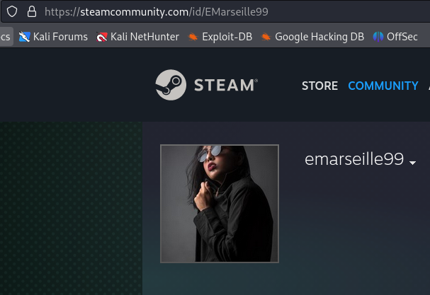

**Q6**: **What is the link to the insider Instagram profile?**  
To answer this question, a simple search of the insider's username on Google will unveil the Instagram link associated with the insider.    

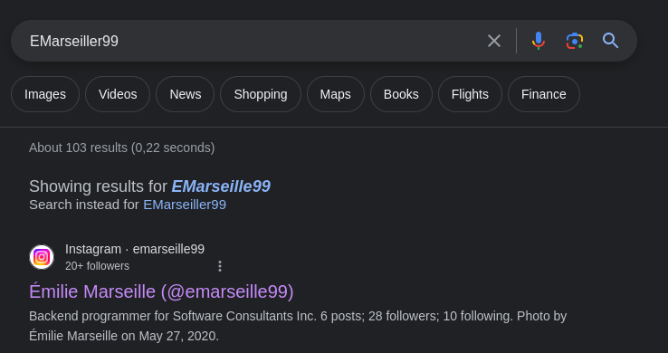  

**Q7**: **Where did the insider go on the holiday? (Country only)**  
I checked her Instagram and found a picture with the caption "holiday." It showed a building in a country in Southeast Asia, and the name of that country starts with the letter 'S.'  

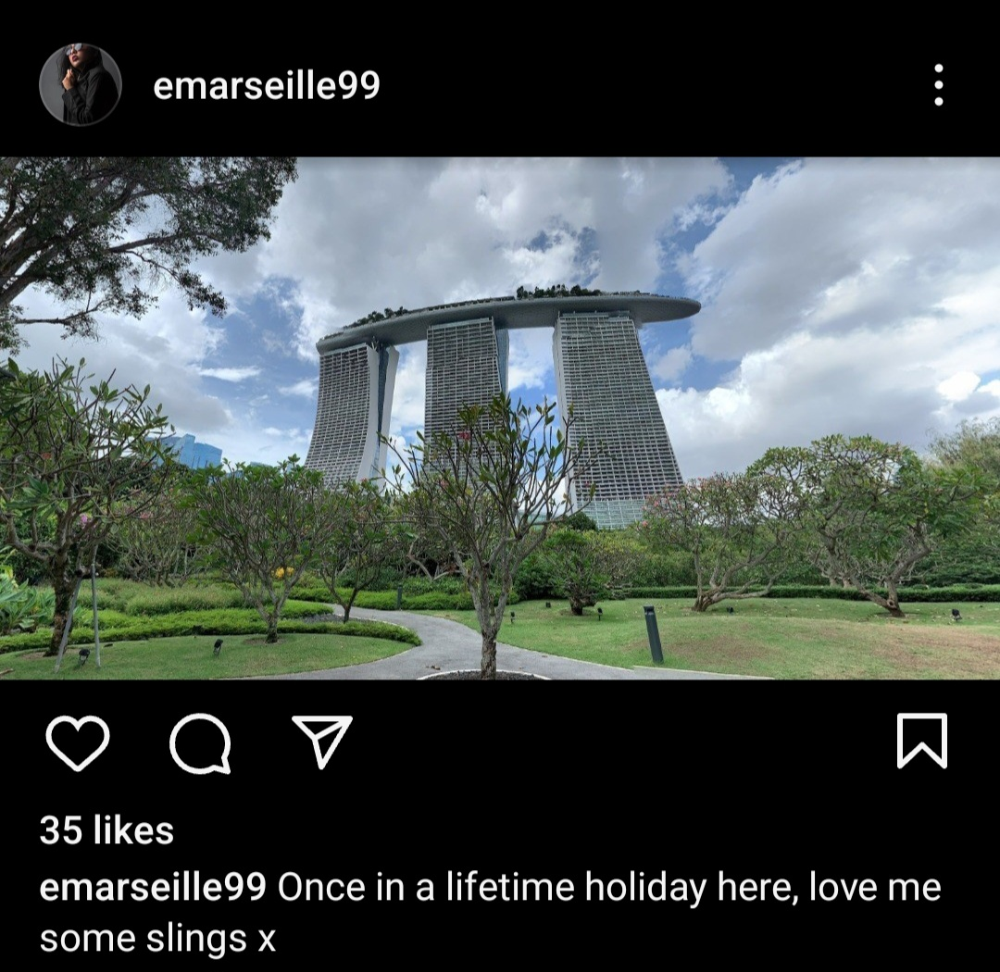  

**Q8**: **Where is the insider family live? (City only)**  
From the insider's Instagram posts, I found two clues about the city her family lives in. The first image has a flag from a Middle Eastern country. In the second image, when zoomed in, there's a famous building in that country, and the city's name starts with the letter 'D.'  

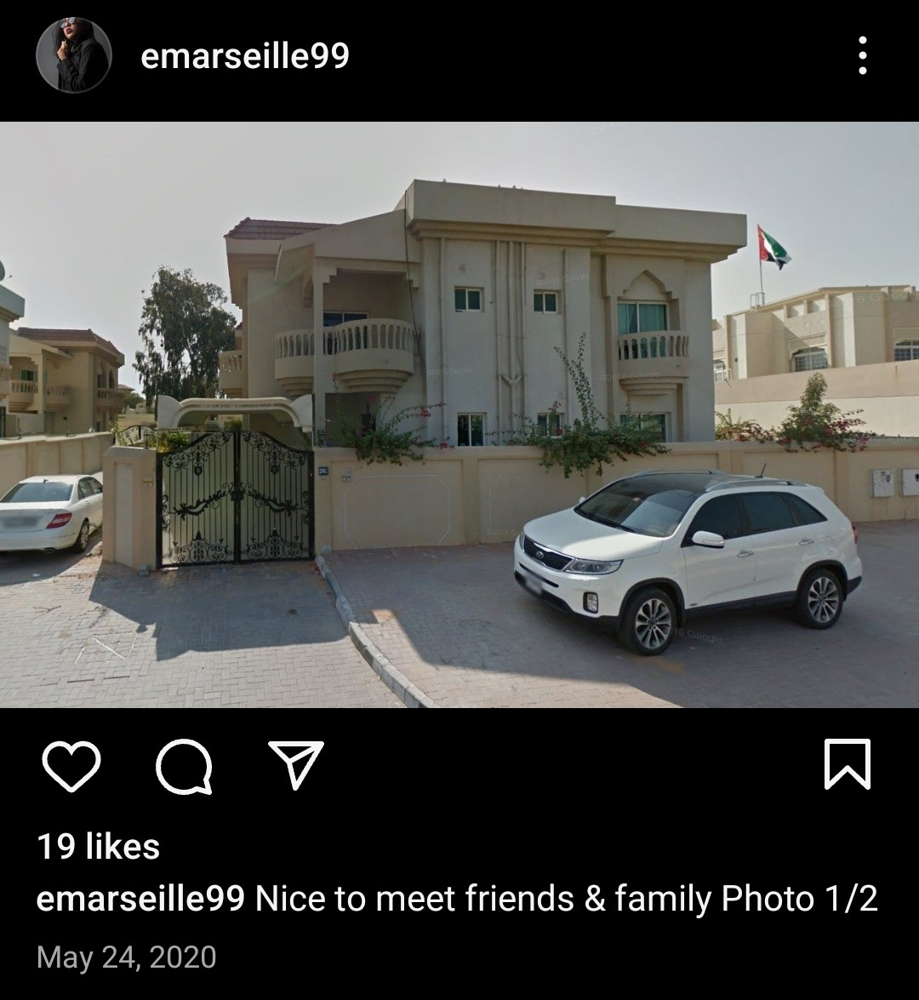  

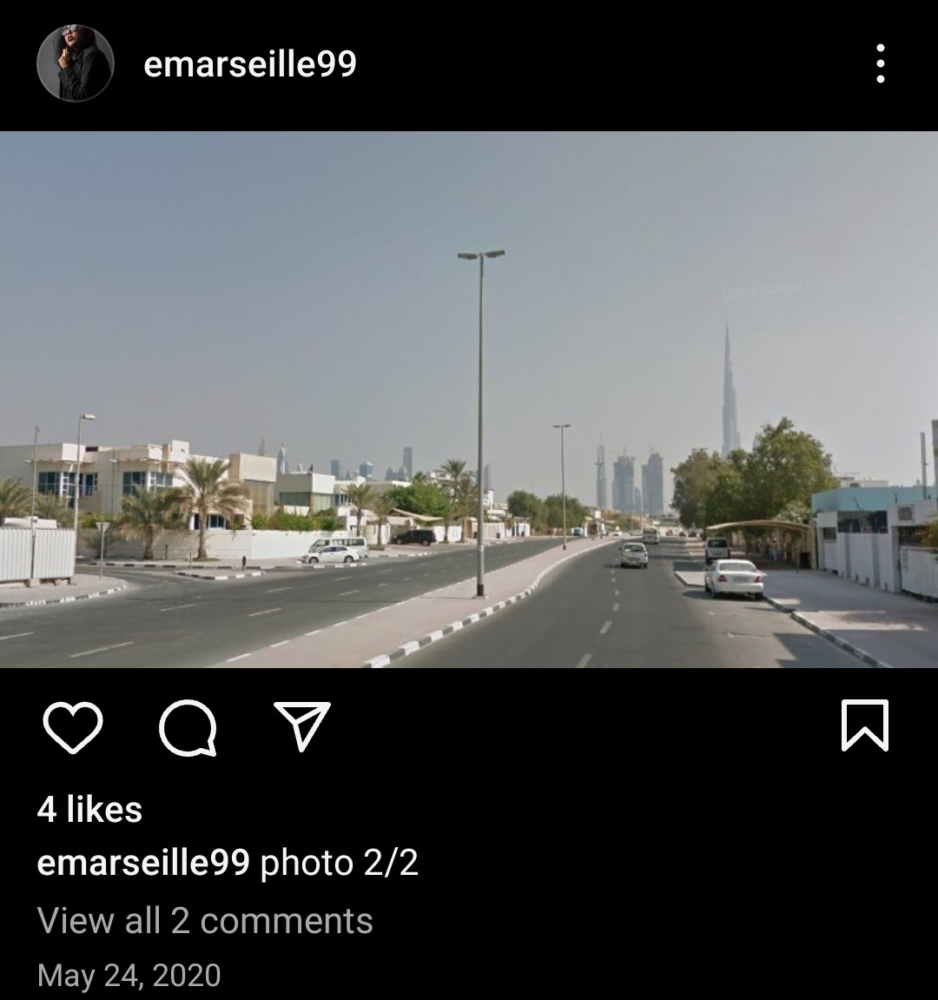  

**Q9**: **File -> office.jpg: You have been provided with a picture of the building in which the company has an office. Which city is the company located in?**  
I looked at the **office.jpg** picture and noticed some interesting words. After searching for the theater name on Google, I found the answer. The city's name starts with the letter 'B.'  

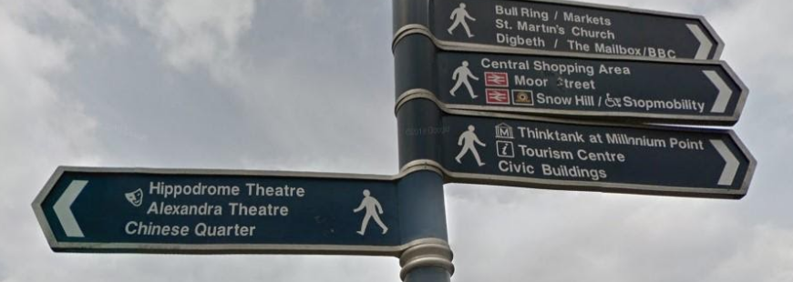  

**Q10**: **File -> Webcam.png: With the intel, you have provided, our ground surveillance unit is now overlooking the person of interest suspected address. They saw them leaving their apartment and followed them to the airport. Their plane took off and has landed in another country. Our intelligence team spotted the target with this IP camera. Which state is this camera in?**  
The solution to the final question lies within the webcam image (**Webcam.png**). To solve the last question, just put together all the words from the webcam image into one sentence and search it on Google. You'll find the answer that way.  

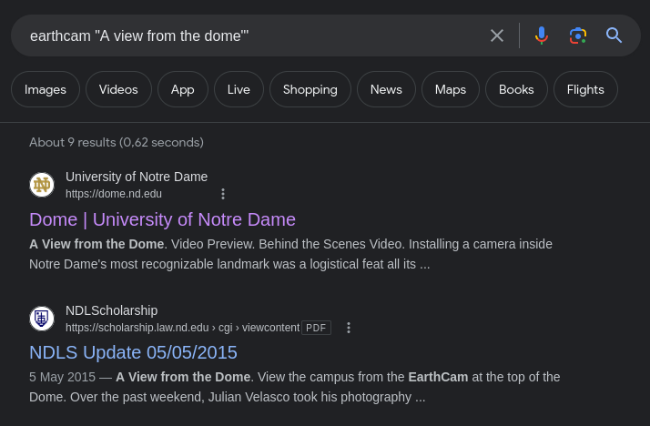  

Once we search using the sentence we formed, we'll likely find a university website among the results. To delve further, we can explore more about the university by searching it on Google. This should lead us to the state where the university is located. For your information, clicking on the university link may reveal the same image as our webcam image.  
