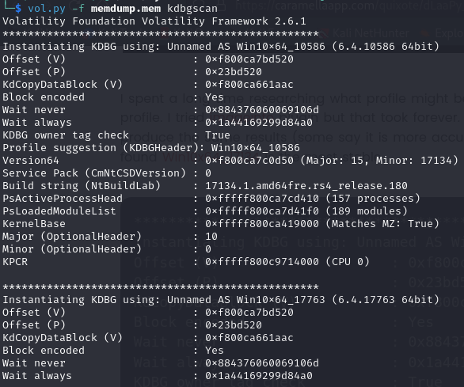
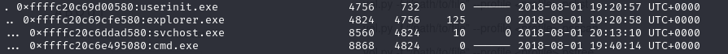
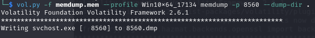
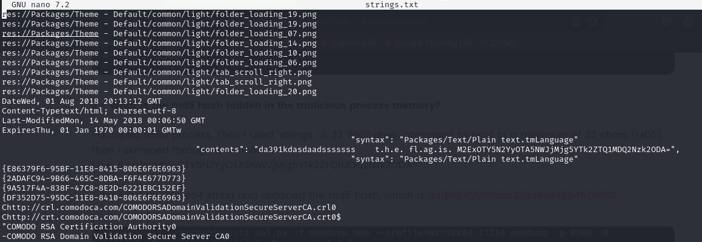
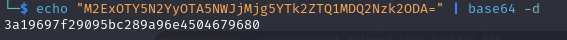
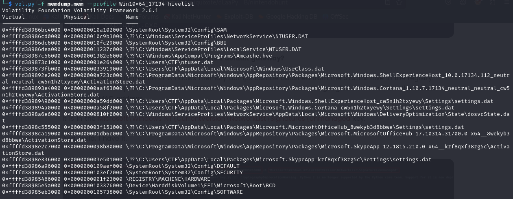
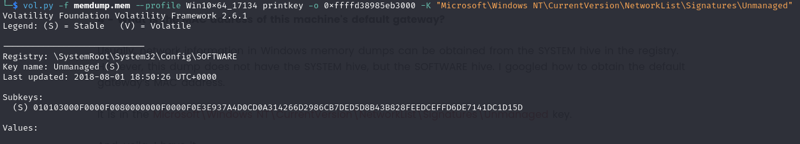
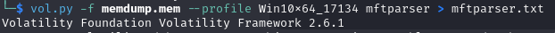
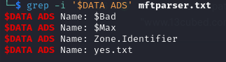
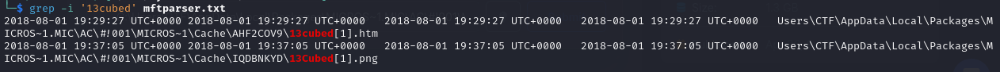

## [NintendoHunt](https://cyberdefenders.org/blueteam-ctf-challenges/nintendohunt/)
### Description
`You have been hired as a soc analyst to investigate a potential security breach at a company. The company has recently noticed unusual network activity and suspects that there may be a malicious process running on one of their computers. Your task is identifying the malicious process and gathering information about its activity.`  
**Tools:** Volatility 2  
**Author:** 13Cubed      
**Difficulty:** Difficult  

### Walkthrough
We will be using Volatility version 2 tool to solve this challenge, as mentioned above. The first thing I did was launch the **imageinfo** plugin from Volatility to discover the profile that would match the memory file. However, after some time, I did not receive any feedback from the plugin. Then, I tried the **kdbgscan** plugin, and it went smoothly. There were many profiles available, but you can choose one. I chose the **Win10x64_17134** profile as I thought it was the most stable version among all profiles.  

  

**Q1**: **What is the process ID of the currently running malicious process?**  
To find the process ID, I used the **pstree** plugin because it was easier to analyse the processes. However, feel free to use another process plugin.  

  

**svchost.exe** in the image above has a suspicious parent. According to [the website](https://www.socinvestigation.com/important-windows-processes-for-threat-hunting/) that I found, **services.exe** should be the parent process of **svchost.exe**, not **explorer.exe**. The process ID for **svchost.exe** is 8560.

**Q2**: **What is the md5 hash hidden in the malicious process memory?**  
I dumped the malicious process memory using the **memdump** plugin and wrote it down in a file. The file I created is named **strings.txt**.  

  

I arranged the content in the file so that each line consists of 32 characters. This makes it simpler to read and uncover the hash.  

  

Following that, I quickly scanned through the file and discovered the hash value. However, it appears that the displayed value is not the actual MD5 hash. I must decode it first, as it seems to be base64-encoded text.

  

  

**Q3**: **What is the process name of the malicious process parent?**  
For this question, we can refer back to the image from the first question. The parent process is already displayed there.  

**Q4**: **What is the MAC address of this machine's default gateway?**  
First, we need to identify the registry location containing network information in Windows. I discovered that the registry is located inside the SOFTWARE hive. I conducted a search of the hive list using the **hivelist** plugin.  

  

After identifying the "\SystemRoot\System32\Config\SOFTWARE" hive path, the next step involves determining the specific location where MAC addresses are stored. Through online research, I found that this information is located in "Microsoft\Windows NT\CurrentVersion\NetworkList\Signatures\Unmanaged". Subsequently, I attempted to uncover the key by combining the virtual address of the hive with the key location path.

  

Next, we identify the subkeys that can be utilized in the subsequent step to retrieve the MAC addresses.  

  

We observe that the MAC address is located at the bottom of the image.  

**Q5**: **What is the name of the file that is hidden in the alternative data stream?**  
To address this question, the **mftparser** plugin can be employed. I recorded the results in a file before proceeding with the data analysis.  

  

Subsequently, I used the **grep** command to search for the hidden file. The **grep** command used '$DATA ADS' since the file is in the data stream. There is only one file in the image below, as the others did not have any extension.  

  

**Q6**: **What is the full path of the browser cache created when the user visited "www.13cubed.com" ?**  
For question 6, solving it involves using **grep** on the mftparser file, similar to the previous question. The pattern is '13cubed' as we need the browser cache of it, and the first full path is the answer of this question as the socnd one is an image file.  

  

