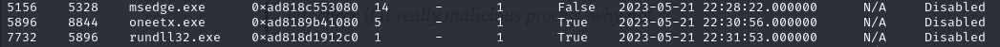
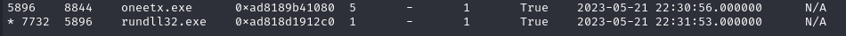
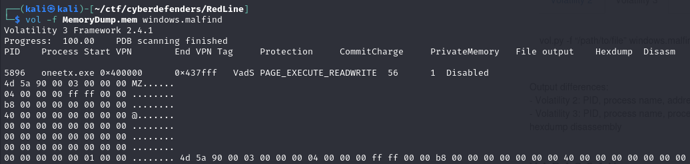
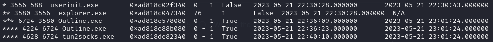
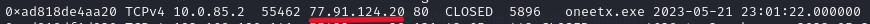
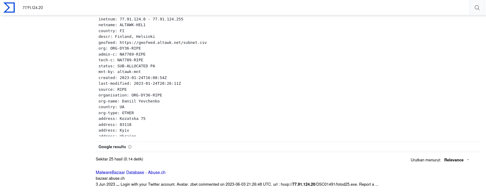
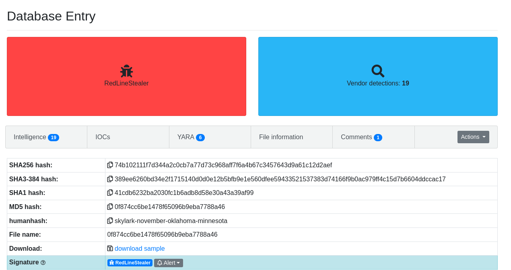
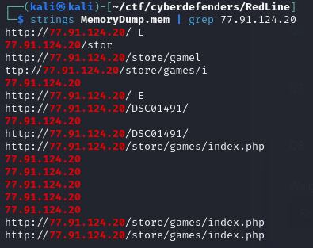
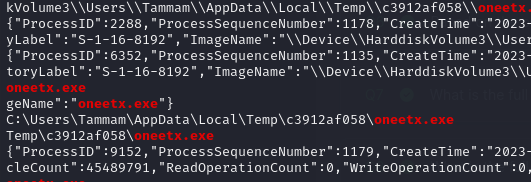

## [RedLine](https://cyberdefenders.org/blueteam-ctf-challenges/106/)
### Description
`As a member of the Security Blue team, your assignment is to analyze a memory dump using Redline and Volatility tools. Your goal is to trace the steps taken by the attacker on the compromised machine and determine how they managed to bypass the Network Intrusion Detection System "NIDS". Your investigation will involve identifying the specific malware family employed in the attack, along with its characteristics. Additionally, your task is to identify and mitigate any traces or footprints left by the attacker.`  
**Tools:** Volatility  
**Author:** Ahmed Tammam      
**Difficulty:** Easy  

### Walkthrough
As mentioned earlier, we will use volatility to check the memory and find signs of the attacker. I chose volatility version 3 for this task, but feel free to use version 2 if you prefer.    

**Q1**: **What is the name of the suspicious process?**  
To answer the first question, I used the **windows.pslist** plugin to list the processes and find the suspicious process.  If you are not familiar with the pslist plugin, you can try alternatives like **windows.psscan** or **windows.pstree**. I suggest using the **windows.pstree** plugin because it shows processes in a hierarchy. However, for this question, I decided to stick with the **windows.pslist** plugin.  

  

Upon inspecting the list of processes, I uncovered a process that appeared suspicious. It has the PID **5896**, and its PPID is **8844**. The reason it is suspicious is because its child process can run dynamic link libraries. This executable could potentially facilitate the execution of malicious code by the attacker.  

  

**Q2** : **What is the child process name of the suspicious process?**  
To identify the child process, the **windows.pstree** plugin. can be employed, allowing us to visualize the process hierarchy.  

  

**Q3** : **What is the memory protection applied to the suspicious process memory region?**  
You can locate memory protection using the **windows.malfind** plugin. This plugin is useful for uncovering hidden or injected code/DLLs in user mode memory.  

  

**Q4** : **What is the name of the process responsible for the VPN connection?**  
To locate the process, we can use the process plugin again. Subsequently, I utilised **pstree** because it displays the hierarchy order of the processes. After some investigation, I identified a process related to network connections named **tun2socks.exe**. This executable is associated with VPN services, assisting in establishing and maintaining VPN connections.  
For more information about the executable, you can visit this URL: https://www.file.net/process/tun2socks.exe.html.  
It is important to note that the finding mentioned above is not the actual answer to the question; it is just a part of the software. The real answer is the parent process of the executable, marked with 3 stars, as **tun2socks.exe** itself is marked with 4 stars. 

  

**Q5** : **What is the attacker's IP address?**  
The question is about finding an IP address. To do this, I used a network scanning plugin called **windows.netscan**. I observed network activity from the suspicious process and noticed it was trying to reach an IP address outside the internal network. This could be the attacker's public IP address.  

**Q6** : **Based on the previous artifacts. What is the name of the malware family?**  
To answer this question, I did some online research. I used the [VirusTotal](https://www.virustotal.com/) website to identify the malware family. In the search bar, I entered the previously found IP address.   

  

I did not find much information about the malware on **VirusTotal**, but I came across a Google search result that caught my attention. The website is called **MalwareBazaar**. When I clicked on it, I found details about the malware family.  

**Q7** : **What is the full URL of the PHP file that the attacker visited?**  
To discover the URL of the PHP file, I used the strings and grep commands. I included the attacker's IP address since we already knew that the malware was attempting to communicate with the attacker's machine.  

  

**Q8** : **What is the full path of the malicious executable?**  
I applied the same method as the previous question, but this time, I searched for the name of the malware executable.  

  
