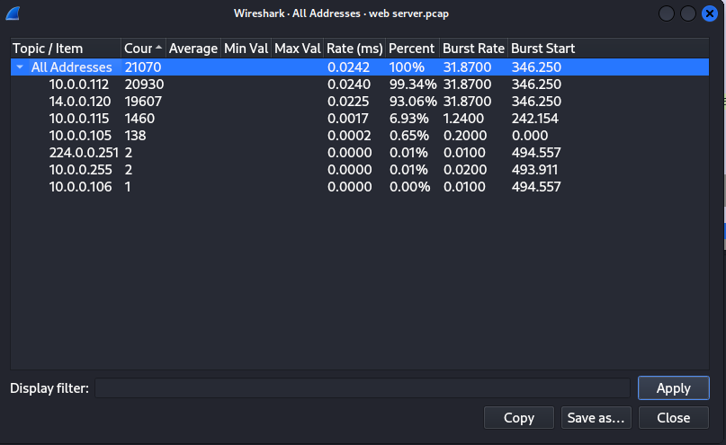
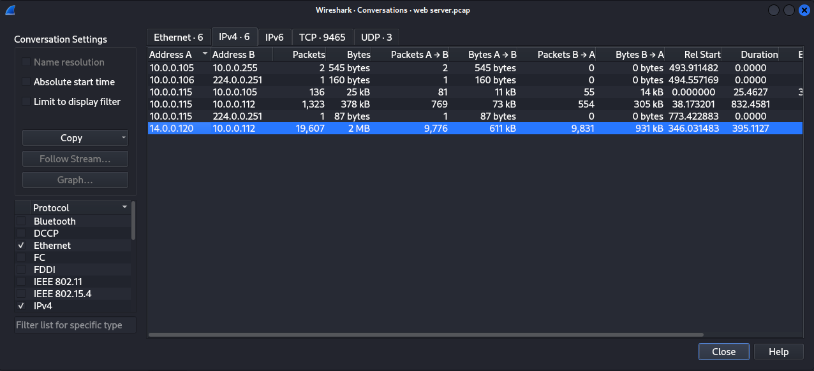
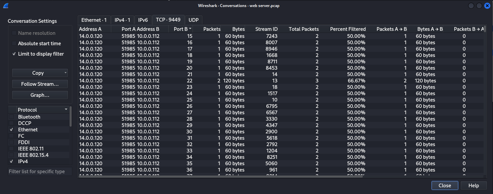
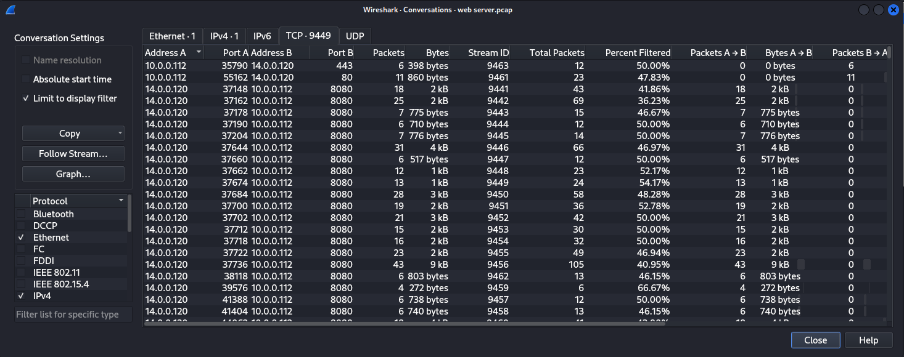
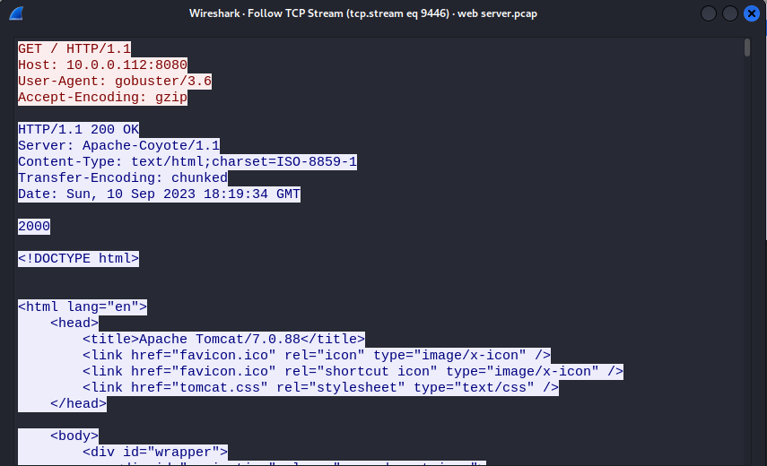
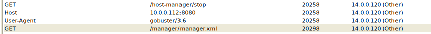
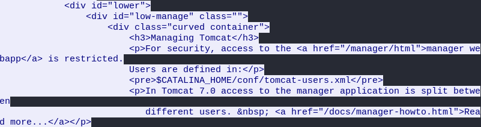
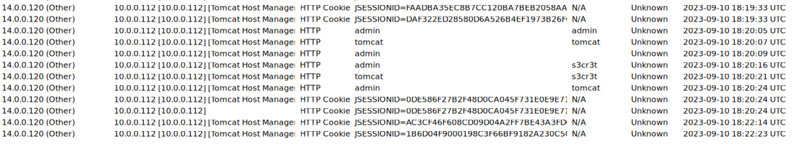
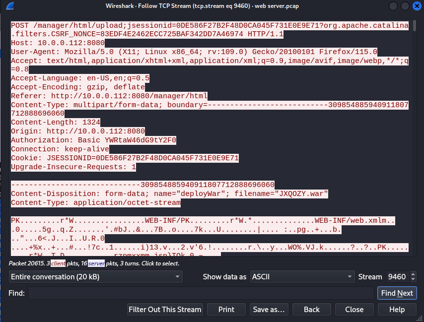

## [TomcatTakeover](https://cyberdefenders.org/blueteam-ctf-challenges/tomcat-takeover/)
### Description
`Our SOC team has detected suspicious activity on one of the web servers within the company's intranet. In order to gain a deeper understanding of the situation, the team has captured network traffic for analysis. This pcap file potentially contains a series of malicious activities that have resulted in the compromise of the Apache Tomcat web server. We need to investigate this incident further.`  
**Tools:** Wireshark, NetworkMiner  
**Author:** Chadou      
**Difficulty:** Easy  

### Walkthrough
In this challenge, I will use two tools to make it easier to find the answer or the solution to each question. The tools have been mentioned in the description.    

**Q1**: **Given the suspicious activity detected on the web server, the pcap analysis shows a series of requests across various ports, suggesting a potential scanning behavior. Can you identify the source IP address responsible for initiating these requests on our server?**  
The question already gave a hint to the answer, which is "a series of requests across various ports." The first thing I did was checking the statistics of the IP addresses of the network in **Wireshark**. What we need to find is the highest percentage of requests.  

  

There are two IP addresses with high requests over the network. After I found those two IP addresses, I attempted to check their conversations. You can access the conversations from 'Statistics > Conversations' on Wireshark.  

  

There is only one-way communication between those suspicious IP addresses, but we need to be sure if the requests were using various ports. At this point, I checked the TCP tab of the Conversations. The image below shows that the requests were using various ports.  

  

**Q2**: **Based on the identified IP address associated with the attacker, can you ascertain the city from which the attacker's activities originated?**  
I used an [IP geolocation](https://www.iplocation.net/) website to answer this question. You just need to enter the suspicious IP address, and it will show you the city.  

**Q3**: **From the pcap analysis, multiple open ports were detected as a result of the attacker's activitie scan. Which of these ports provides access to the web server admin panel?**  
Actually, the port for web server admin panel is a trivial matter. The clue lies in the title of this challenge. If you are familiar with website development, you can answer this question without relying on Google. However, if needed, Google can be used to identify the web server admin panel port. Additionally, you can verify the port through TCP conversation analysis.  

  

**Q4**: **Following the discovery of open ports on our server, it appears that the attacker attempted to enumerate and uncover directories and files on our web server. Which tools can you identify from the analysis that assisted the attacker in this enumeration process?**  
Building upon the information from the previous answer in Wireshark, we can identify a suspicious request with an unusual user agent. By conducting a search on Google, we can determine exactly what it is.  

  

**Q5**: **Subsequent to their efforts to enumerate directories on our web server, the attacker made numerous requests trying to identify administrative interfaces. Which specific directory associated with the admin panel was the attacker able to uncover?**  
I used NetworkMiner to help me check the requests. I found many folders revealed by the attacker's tool.

  

After that, I used Wireshark to look more closely at the requests. Eventually, I identified a specific request that confirmed the association of the directory with the admin panel.  

  

**Q6**: **Upon accessing the admin panel, the attacker made attempts to brute-force the login credentials. From the data, can you identify the correct username and password combination that the attacker successfully used for authorization?**  
For this question, I only used NetworkMiner because it made it simple to spot the attempts to guess credentials. However, you can also use Wireshark by just adding **POST** method to the last Wireshark filter. The crucial hint lies in the final combination.  

  

**Q7**: **Once inside the admin panel, the attacker attempted to upload a file with the intent of establishing a reverse shell. Can you identify the name of this malicious file from the captured data?**  
If you come across a suspicious request using the **POST** method, you should be able to see the name of the malicious file that was uploaded to the web server.  

**Q8**: **Upon successfully establishing a reverse shell on our server, the attacker aimed to ensure persistence on the compromised machine. From the analysis, can you determine the specific command they are scheduled to run to maintain their presence?**  
For this question, follow the TCP requests sent by the attacker after the reverse shell was uploaded. Additionally, check examples of reverse shells on Google to understand the typical command that is used.  

  
