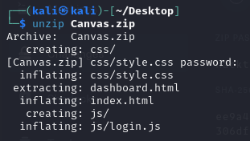
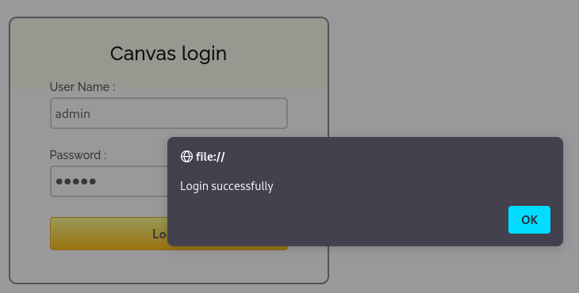
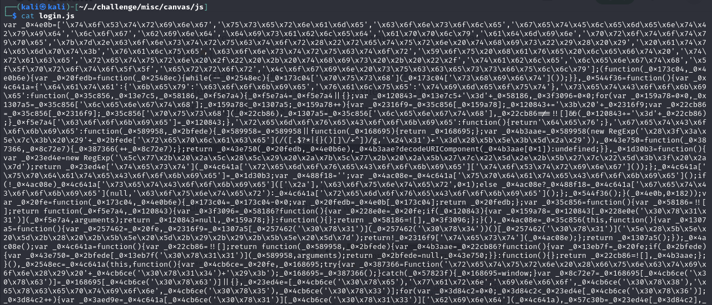
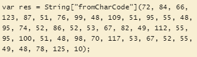
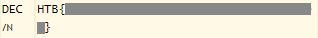

## Canvas
### Description
`We want to update our website but we are unable to because the developer who coded this left today. Can you take a look?`   
**Author:** felamos  
**Flag Format:** picoCTF{FLAG}   
**Challenge Type:** Misc  
**Difficulty:** Easy  
**Point:** 10 points  

### Walkthrough
I received a zip file that was provided for the challenge. Therefore, I need to unzip the file first. I used the Linux `unzip` command to accomplish this task.

After we unzipped the file, we recognised that the files inside the zip file are HTML files. When we opened them in a browser, it became apparent that there is a login page.

My initial thought upon encountering a login page was that I needed to test the website by guessing the username and password using common credentials. After trying a few sets of credentials, a prompt appeared, it said `Login successfully`. The login was successful when I used the username `admin` and the password `admin`.

After that, we arrived at a dashboard page with a flag, but the content of the flag is unusual. 

This means that it is not the authentic flag. It seemed too good to be true.

Then, I decided to search through the files that had been downloaded earlier. I discovered interesting content inside the `login.js` file. The content was in an unreadable form.

Since it is a JavaScript file, my initial thought was that it might be a basic **JS Obfuscation**.

So, I tried to deobfuscate it using an online tool from [dCode](https://www.dcode.fr/javascript-unobfuscator) website.

After that, I found an interesting variable.

It appears that the values of the variable are in ASCII format. To reveal the actual flag, I just need to convert the ASCII format to text. I also used the [dCode](https://www.dcode.fr/ascii-code) website to perform the ASCII to text conversion.

Finally, we obtained the flag.

