## BFT
### Description
`In this Sherlock, you will become acquainted with MFT (Master File Table) forensics. You will be introduced to well-known tools and methodologies for analyzing MFT artifacts to identify malicious activity. During our analysis, you will utilize the MFTECmd tool to parse the provided MFT file, TimeLine Explorer to open and analyze the results from the parsed MFT, and a Hex editor to recover file contents from the MFT.`  
**Tools:** MFTECmd, TimeLine Explorer, HxD  
**Author:** [CyberJunkie](https://app.hackthebox.com/users/468989)  
**Difficulty:** Very Easy  

### Walkthrough
You can download MFTECmd and TimeLine Explorer [here](https://ericzimmerman.github.io/#!index.md).  
For the HxD hex editor, you can download it [here](https://mh-nexus.de/en/downloads.php?product=HxD20). However, you may use any hex editor of your choice.  
  
We will receive a ZIP file containing a folder with an MFT file inside. After unzipping it, convert the file to an Excel format by using the MFTECmd tool to transform it into a CSV file.  
Here is the command I used: `.\MFTECmd.exe -f '<MFT file path>' --csv '<output file path>' --csvf <file name>.csv`    

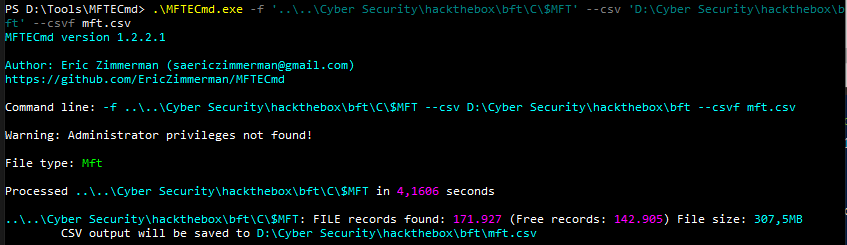  

Then, open the CSV file in TimeLine Explorer to view its content comfortably. We can now answer question 1.  
 
**Task 1**  
>Question: **Simon Stark was targeted by attackers on February 13. He downloaded a ZIP file from a link received in an email. What was the name of the ZIP file he downloaded from the link?**   

Answer: 
Stage-20240213T093324Z-001.zip

In this task, I filtered by parent path and file extension to find the downloaded ZIP file.  

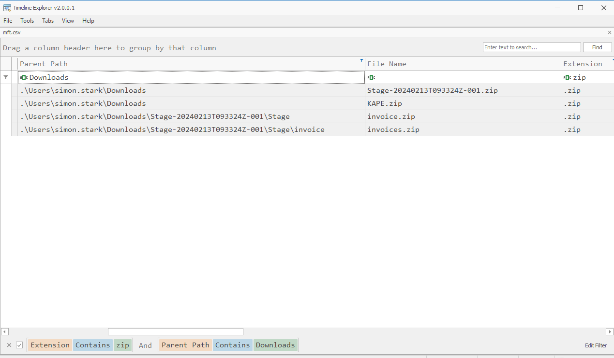  

We need more information to identify the correct ZIP file. Therefore, I checked the creation times of the files. The first file appears to be the correct one because the year 1980 is no longer relevant. Additionally, the name and path of the file are shown in the image above, confirming that the first file is the suspicious ZIP file.  

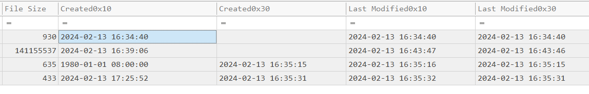  

**Task 2**  
>Question: **Examine the Zone Identifier contents for the initially downloaded ZIP file. This field reveals the HostUrl from where the file was downloaded, serving as a valuable Indicator of Compromise (IOC) in our investigation/analysis. What is the full Host URL from where this ZIP file was downloaded?**   

Answer: 
https://storage.googleapis.com/drive-bulk-export-anonymous/20240213T093324.039Z/4133399871716478688/a40aecd0-1cf3-4f88-b55a-e188d5c1c04f/1/c277a8b4-afa9-4d34-b8ca-e1eb5e5f983c?authuser

To answer task 2, remove the **zip** filter and then filter the file names using the keyword **zone**. Look for entries with "Zone.Identifier" next to the file names. To find the HostUrl, examine the Zone Id Contents in the right columns and focus on the row of the identified ZIP file. "ZoneId=3" here indicates that the file was downloaded from the internet and is generally considered untrusted.  

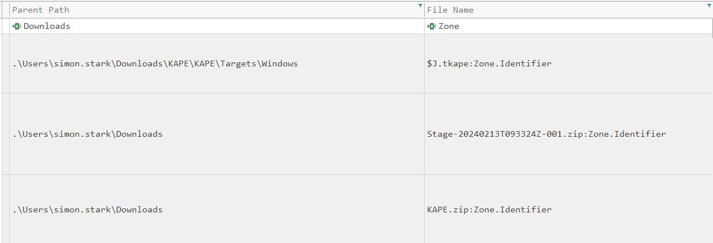  
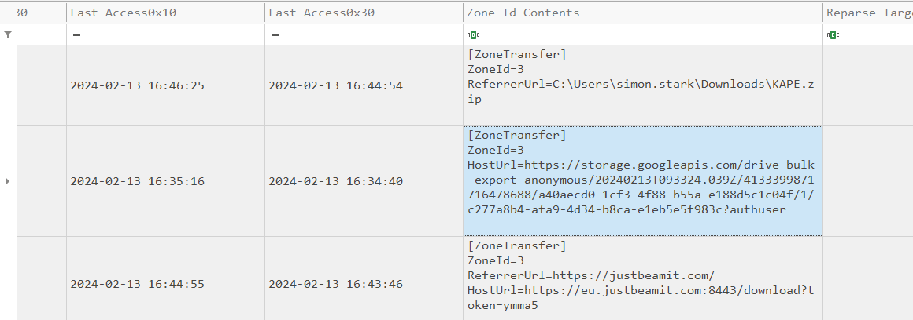  

**Task 3**  
>Question: **What is the full path and name of the malicious file that executed malicious code and connected to a C2 server?**   

Answer: 
C:\Users\simon.stark\Downloads\Stage-20240213T093324Z-001\Stage\invoice\invoices\invoice.bat
  

It seems that the program first downloads and unzips a file.  

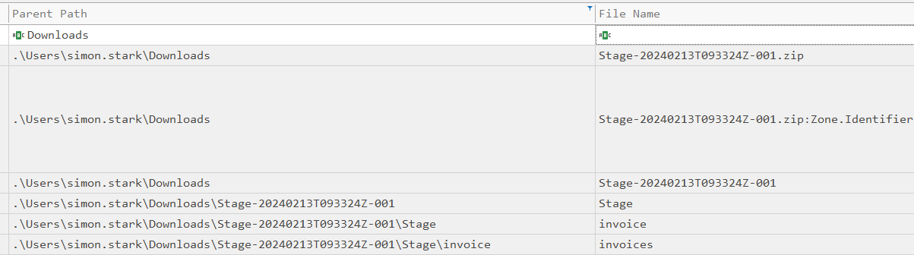  

Then executes a script from within the unzipped contents, and also unzip a second ZIP file as part of its process.  

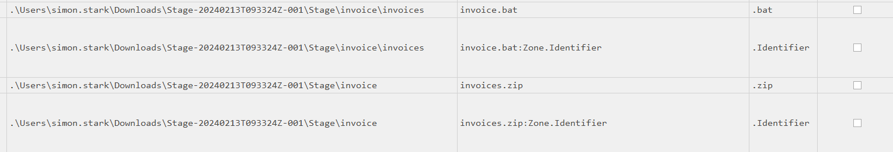 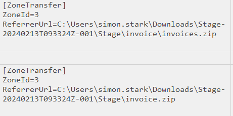  

The file extension **.bat** is indeed suspicious, as it indicates a batch script, which can be used to execute various commands on a system.  
To confirm whether this file is connected to a C2 (Command and Control) server, follow these steps:  
1. Find the entry number of the file, which is shown on the left side of the image (23436).

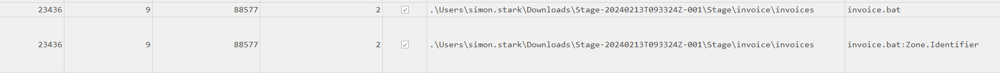  

2. Calculate the Offset: Use the entry number to calculate the offset with this formula
`Offset = Entry Number * 1024 bytes = 23436 * 1024 = 23998464`  

3. Change the decimal number to hexadecimal number. I used online converter to change it to hexadecimal number.  

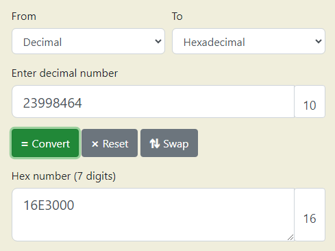  

4. Lastly, use HxD or your preferred hex editor to read the file. If using HxD, press `Control + G` and enter the offset to jump to the specific location.
 
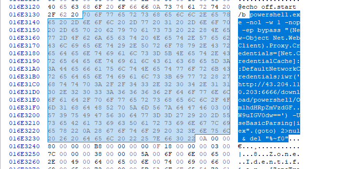  

You will see a command attempting to communicate with an IP address. This indicates that the **.bat** file is a malicious script designed to connect to a C2 server.  

**Task 4**  
>Question: **Analyze the $Created0x30 timestamp for the previously identified file. When was this file created on disk?**   

Answer: 
2024-02-13 16:38:39

For Task 4, see the time displayed in the right column next to the file name.  

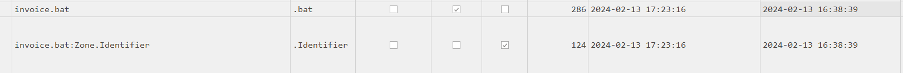  

The answers to the last two tasks can be found from the previous findings.  

**Task 5**  
>Question: **Finding the hex offset of an MFT record is beneficial in many investigative scenarios. Find the hex offset of the stager file from Question 3.**   

Answer: 
16E3000

**Task 6**  
>Question: **Each MFT record is 1024 bytes in size. If a file on disk has smaller size than 1024 bytes, they can be stored directly on MFT File itself. These are called MFT Resident files. During Windows File system Investigation, its crucial to look for any malicious/suspicious files that may be resident in MFT. This way we can find contents of malicious files/scripts. Find the contents of The malicious stager identified in Question3 and answer with the C2 IP and port.**   

Answer: 
43.204.110.203:6666

