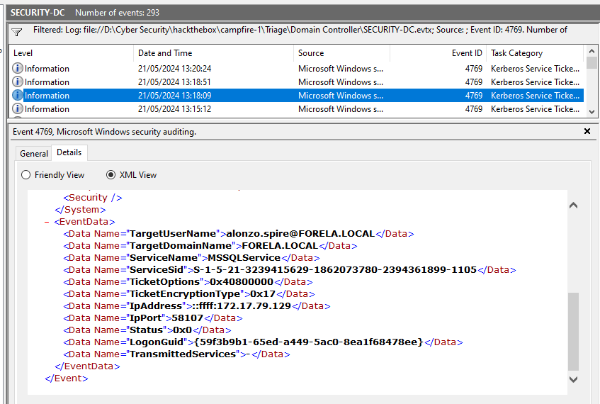
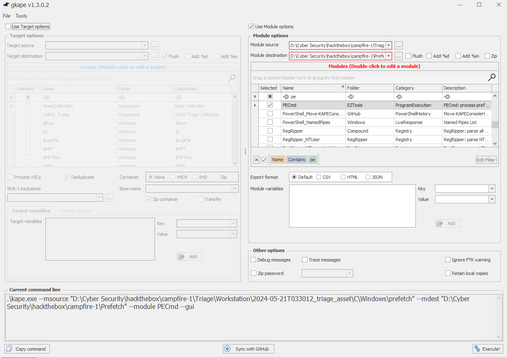
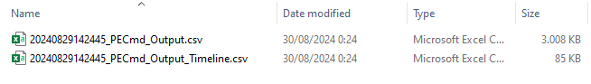
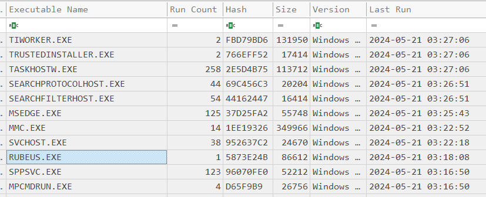
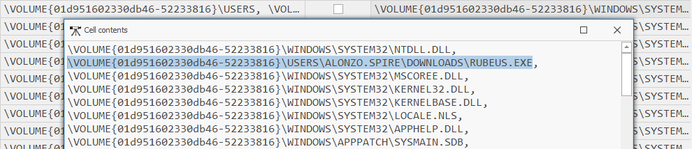
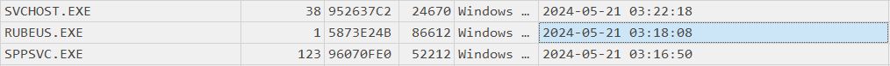

## Campfire 1
### Description
`Alonzo Spotted Weird files on his computer and informed the newly assembled SOC Team. Assessing the situation it is believed a Kerberoasting attack may have occurred in the network. It is your job to confirm the findings by analyzing the provided evidence. You are provided with: 1- Security Logs from the Domain Controller 2- PowerShell-Operational Logs from the affected workstation 3- Prefetch Files from the affected workstation.`  
**Tools:** PECmd, TimeLine Explorer, KAPE, Windows Event Viewer  
**Author:** [CyberJunkie](https://app.hackthebox.com/users/468989)  
**Difficulty:** Very Easy  

### Walkthrough
You can download PECmd and TimeLine Explorer [here](https://ericzimmerman.github.io/#!index.md), or you can download [KAPE](https://www.kroll.com/en/services/cyber-risk/incident-response-litigation-support/kroll-artifact-parser-extractor-kape) instead of PECmd. KAPE is a very popular tool in digital forensics, and it includes many tools that are used in digital forensics investigations.  
  
We will receive a ZIP file containing a folder with two directories inside. Within these directories, there are event log files and prefetch files. After unzipping it, navigate to the **Domain Controller** folder and open the **.evtx** file using **Windows Event Viewer**.    
  
Next, proceed to the first task.  
  
**Task 1**  
>Question: **Analyzing Domain Controller Security Logs, can you confirm the date & time when the kerberoasting activity occurred?**   

Answer: 
2024-05-21 03:18:09
  

Based on the [IBM website](https://www.ibm.com/topics/kerberoasting#:~:text=Kerberoasting%20is%20a%20cyberattack%20that,data%2C%20spread%20malware%20and%20more.), Kerberoasting is an attack in which threat actors steal Kerberos service tickets to obtain the plaintext passwords of network service accounts. Therefore, we need to examine the Kerberos service tickets in Windows Event Viewer. Look for a suspicious event with a service name that differs from the others.  
  
  

From the image above, we can also answer tasks 2 and 3.  
  
**Task 2**  
>Question: **What is the Service Name that was targeted?**  

Answer: 
MSSQLService
  
  
**Task 3**  
>Question: **It is really important to identify the Workstation from which this activity occurred. What is the IP Address of the workstation?**   

Answer: 
172.17.79.129
  

**Task 4**  
>Question: **Now that we have identified the workstation, a triage including PowerShell logs and Prefetch files are provided to you for some deeper insights so we can understand how this activity occurred on the endpoint. What is the name of the file used to Enumerate Active directory objects and possibly find Kerberoastable accounts in the network?**   

Answer: 
powerview.ps1
  
  
Now, we need to check the PowerShell logs inside the Workstation folder. There is a task category called 'Execute a Remote Command,' which the threat actor used to inject the adversary's payload. The relevant Event ID is 4104. From there, you will see the name of the malicious file.  
  
  

**Task 5**  
>Question: **When was this script executed?**   

Answer: 
2024-05-21 03:16:32
  

The answer to task 5 is also found in the previous image. Note that the date and time we are looking for are displayed in system time.  

The next two tasks involve prefetch files. I used the GUI **KAPE** tool and the PECmd module to convert the prefetch files to CSV format. However, you can also use the **PECmd** tool via the command line. I prefer to use the GUI version of KAPE because it's easier.  
  
  

After obtaining the CSV file, open it using the **TimeLine Explorer** tool to view the data.  

  
  
**Task 6**  
>Question: **What is the full path of the tool used to perform the actual kerberoasting attack?**   

Answer: 
C:\Users\Alonzo.spire\Downloads\Rubeus.exe
  

Then, search for an event that occurred around the time you discovered in task 5. You will find a suspicious executable file and its path. For the drive name, you can determine it by relating to the previous findings.  

  

  
  
**Task 7**  
>Question: **When was the tool executed to dump credentials?**  

Answer: 
2024-05-21 03:18:08
  

From the same data row, you can also acquire the timestamp.  

  
