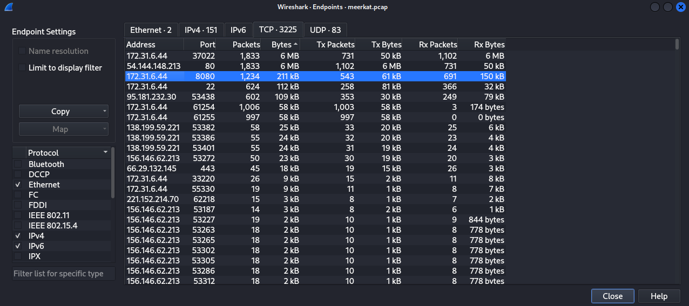
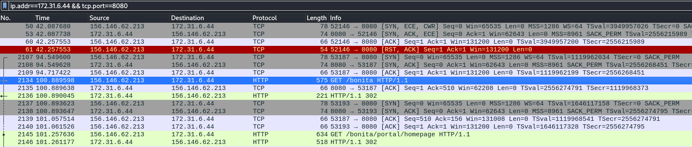
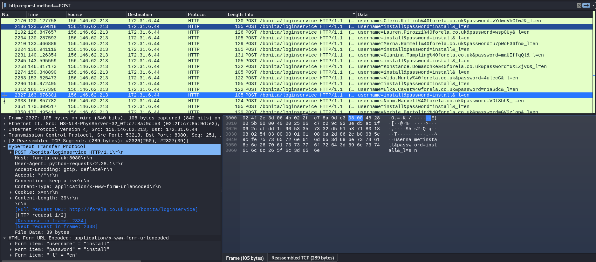
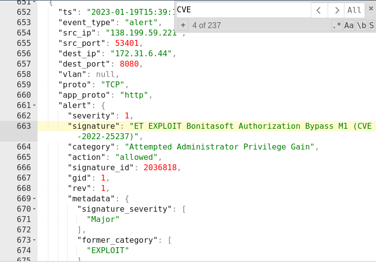
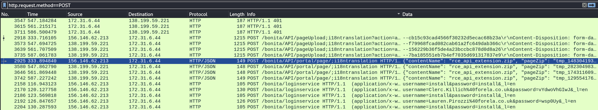
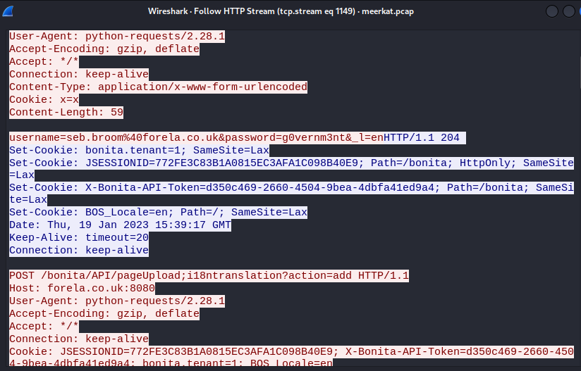
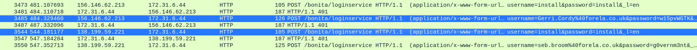
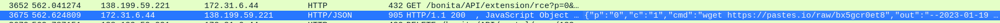
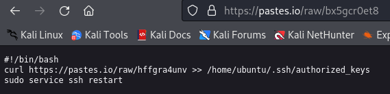

## Meerkat
### Description
`As a fast growing startup, Forela have been utilising a business management platform. Unfortunately our documentation is scarce and our administrators aren't the most security aware. As our new security provider we'd like you to take a look at some PCAP and log data we have exported to confirm if we have (or have not) been compromised.`   
**Author:** sebh24  
**Flag Format:** HTB{FLAG}   
**Difficulty:** Easy  

### Walkthrough
We will receive a zip file containing a .pcap file for the network traffic events and a JSON file that has security events associated with the suspicious network traffics.

After the file is unzipped, the first thing I analyze is the pcap file. I analyzed it using **Wireshark**, which is a tool for network analysis, and it also uses the .pcap extension for the files exported from it.

While using Wireshark, I typically check for the endpoint network traffic, accessible through `Statistics > Endpoints`. Then, I filter it by TCP and Bytes in descending order. Here, I discovered that port 8080 (an alternative port for HTTP) from IP address 172.31.6.44 has a significant amount of data transferred to the destination with 1234 packets. Therefore, I applied the filter only for that source IP and port. To apply the filter, `right-click on the chosen network > Apply as Filter > Selected`.

After filtering the network, we observed an HTTP request with an intriguing name: 'GET /bonita HTTP/1.1'. A quick Google search revealed that 'bonita' refers to Business Process Management Software from Bonitasoft. With this information, we can now answer Task 1.  

**Task 1**  
>Question: **We believe our Business Management Platform server has been compromised. Please can you confirm the name of the application running?**   

Answer: 
Bonitasoft

To dig deeper into the requests, I decided to filter the request method to POST. Apparently, numerous POST requests were made to the 'loginservice' page, and the data being sent included usernames and passwords.

To make it clear, I added a new column displaying the HTTP data. This column can be added by following these steps: `Edit > Preferences > on the columns tab, add one column > on the Fields column, type "http.file_data" > on the Type column, choose "Custom" (the Title can also be changed to your preference) > select the OK button`.

Considering the different usernames and passwords the attacker used, and observing that the usernames include the domain from the exposed data of an organization, we can conclude that it is a credential stuffing attack.

**Task 2**  
>Question: **We believe the attacker may have used a subset of the brute forcing attack category - what is the name of the attack carried out?**   

Answer: 
Credential Stuffing

On the next task, we need to investigate the CVE number associated with the attack. Since the JSON file we received contains security events information, we can read the JSON file in the hope of finding the identified CVE number. I used JSON pretty print to comfortably read the file.  

**Task 3**  
>Question: **Does the vulnerability exploited have a CVE assigned - and if so, which one?**   

Answer: 
CVE-2022-25237

When we thoroughly examine the HTTP POST requests, we can find the answer for the next task. As depicted in the picture below, there is a string appended to the API URL.  

**Task 4**  
>Question: **Which string was appended to the API URL path to bypass the authorization filter by the attacker's exploit?**   

Answer: 
i18ntranslation

The next task is to count the unique credentials that the attacker used. To achieve this, I utilized **tshark** in conjunction with some Linux commands.  
`tshark -r meerkat.pcap -Y 'http.request.method == POST' -o data.show_as_text:TRUE -T fields -e urlencoded-form.value | sort | uniq -c | sort -n`  
Following that, we can manually count the unique credentials based on the output.

**Task 5**  
>Question: **How many combinations of usernames and passwords were used in the credential stuffing attack?**   

Answer: 
56

Then, I followed the HTTP stream of the last POST request to identify which credential successfully logged in.

**Task 6**  
>Question: **Which username and password combination was successful?**   

Answer: 
seb.broom@forela.co.uk:g0vernm3nt

At this point, I discovered an interesting fact. The attacker appears to be changing the IP address from 156.146.62.213 to 138.199.59.221 after multiple failed login attempts.  

After changing the IP address, the attacker successfully logged in with the correct credentials. Subsequently, they posted the "rce_api_extension.zip" file, inspected the /etc/passwd file, deleted the zip file to erase any traces, and then uploaded the zip file again. Finally, the attacker accessed a text-sharing site to download a script file to the server. I observed that the attacker attempted to remove the tracks every time an action was taken on the server.

The text-sharing site I identified is shown in the picture below.

**Task 7**  
>Question: **If any, which text sharing site did the attacker utilise?**   

Answer: 
pastes.io

The site utilized by the attacker contains a script connected to another site that appears to have an SSH public key. By reading that script, we can make a guess about the filename of the public key.

**Task 9**  
>Question: **Please provide the filename of the public key used by the attacker to gain persistence on our host.**   

Answer: 
hffgra4unv

From the script, it is clear that the public key was appended to the SSH authorized keys file. This is how the attacker achieved persistence on the host.  

**Task 10**  
>Question: **Can you confirmed the file modified by the attacker to gain persistence?**   

Answer: 
/home/ubuntu/.ssh/authorized_keys

Looking into the [MITRE ATT&CK Matrix](https://attack.mitre.org/tactics/TA0003/), we can find the technique ID related to this attack. The technique used by the attacker falls under "SSH Authorized Keys" in the Account Manipulation category within the Persistence tactic.  

**Task 11**  
>Question: **Can you confirm the MITRE technique ID of this type of persistence mechanism?**   

Answer: 
T1098.004

