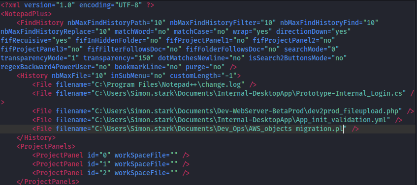
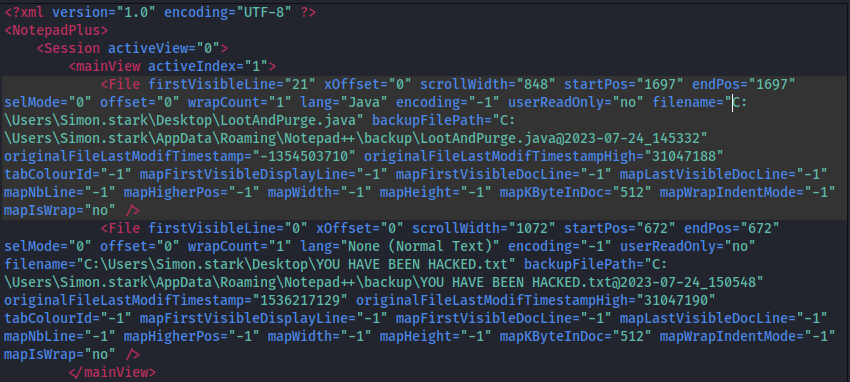
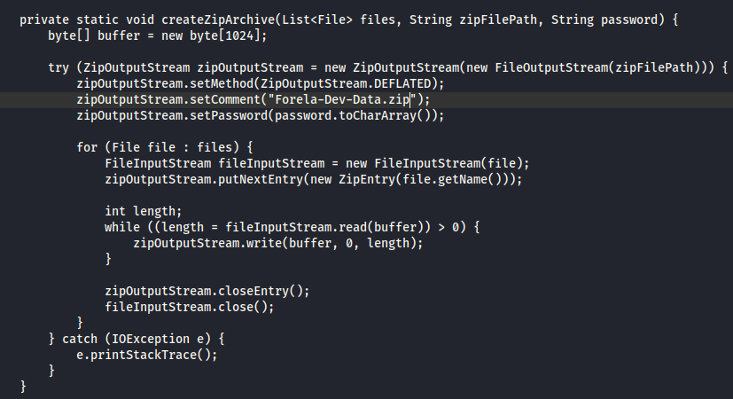
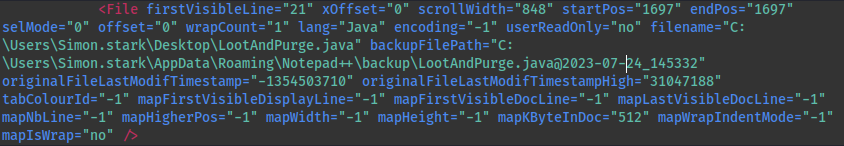
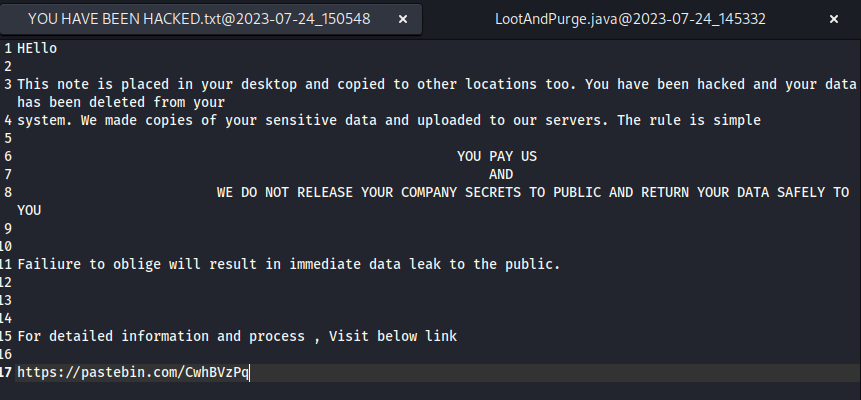
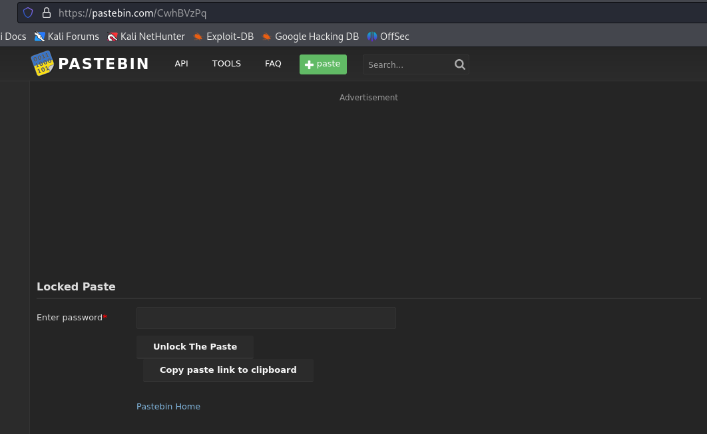
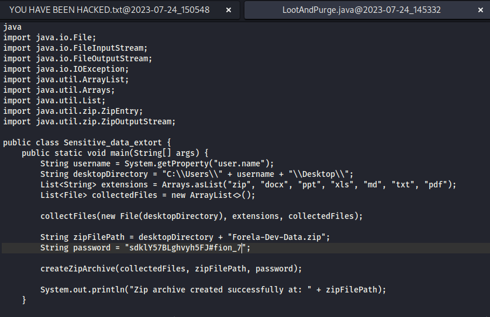
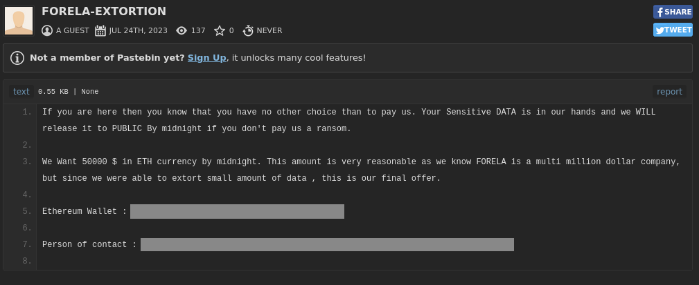

## Noted
### Description
`Simon, a developer working at Forela, notified the CERT team about a note that appeared on his desktop. The note claimed that his system had been compromised and that sensitive data from Simon's workstation had been collected. The perpetrators performed data extortion on his workstation and are now threatening to release the data on the dark web unless their demands are met. Simon's workstation contained multiple sensitive files, including planned software projects, internal development plans, and application codebases. The threat intelligence team believes that the threat actor made some mistakes, but they have not found any way to contact the threat actors. The company's stakeholders are insisting that this incident be resolved and all sensitive data be recovered. They demand that under no circumstances should the data be leaked. As our junior security analyst, you have been assigned a specific type of DFIR (Digital Forensics and Incident Response) investigation in this case. The CERT lead, after triaging the workstation, has provided you with only the Notepad++ artifacts, suspecting that the attacker created the extortion note and conducted other activities with hands-on keyboard access. Your duty is to determine how the attack occurred and find a way to contact the threat actors, as they accidentally locked out their own contact information.`   
**Author:** CyberJunkie     
**Difficulty:** Easy  

### Walkthrough
We will receive a zip file named **Noted.zip**. Upon unzipping the file, I found one folder and one file. Subsequently, I decided to investigate the file within the folder I had received earlier. Inside, I discovered a folder named **backup** and two XML files: config.xml and session.xml, which seem to contain the clues we need to answer the questions.  

The first question is about how the user operates AWS, so it makes sense to check the configuration file, which is **config.xml**. in this case. By looking through this file, I found the full path of the script used for AWS operations.  



**Task 1**  
>Question: **What is the full path of the script used by Simon for AWS operations?**   
<details><summary>Answer: </summary>C:\Users\Simon.stark\Documents\Dev_Ops\AWS_objects migration.pl</details>  

Next, we need to discover the full path of the attacker's program source file. I continued by searching through the next file named **session.xml**. Upon reviewing its contents, I found two suspicious file names. These must be files from the attacker. However, only one of them is the program's source file. The second file has a txt extension, which means it cannot be the program's source file. Therefore, the first one is the answer.



**Task 2**  
>Question: **The attacker duplicated some program code and compiled it on the system, knowing that the victim was a software engineer and had all the necessary utilities. They did this to blend into the environment and didn't bring any of their tools. This code gathered sensitive data and prepared it for exfiltration. What is the full path of the program's source file?**   
<details><summary>Answer: </summary>C:\Users\simon.stark\Desktop\LootAndPurge.java</details>

Then, moving on to the next question, we need to uncover the final archive file containing all the data. Proceeding to the backup folder, I noticed a source file that the attacker had utilized. Examining this file, written in the Java programming language, I discovered a function for creating a zip file. Thus, within this, lies the zip file name we are searching for.



**Task 3**  
>Question: **What's the name of the final archive file containing all the data to be exfiltrated?**   
<details><summary>Answer: </summary>Forela-Dev-Data.zip</details>

The next question is a bit tricky, as it requires the timestamp in UTC. In **session.xml**, we observe an original last modified timestamp. However, this is represented by a number that can be negative, and curiously, there is also an 'original last modified timestamp high' value.  



From these clues, I began researching what they mean. I then discovered that the original timestamp in the XML file is in Windows FILETIME format and is represented as a 32-bit integer. To obtain the UTC timestamp, we need to combine the low and high timestamps into a 64-bit integer, convert it to a Unix timestamp, and finally convert that to a UTC timestamp.  
The code below, written in Python, allows you to instantly obtain the result. The high and low timestamps are taken from the first file, as it pertains to the program's source file:  

```
import datetime

def filetime_to_dt(filetime):
    """
    Convert Windows FILETIME to Python datetime.
    Windows FILETIME is the number of 100-nanosecond intervals since January 1, 1601 (UTC).
    """
    # Convert FILETIME to a Unix timestamp
    unix_timestamp = (filetime - 116444736000000000) // 10000000
    return datetime.datetime.utcfromtimestamp(unix_timestamp)

def main():
    high = #CHANGE THIS TO THE ORIGINAL MODIFIED HIGH TIMESTAMP VALUE# 
    low = #CHANGE THIS TO THE ORIGINAL MODIFIED LOW TIMESTAMP VALUE# 

    # Ensure the low part is treated as unsigned 32-bit integer
    if low < 0:
        low += 1 << 32

    # Combine high and low to form a 64-bit integer
    filetime = (high << 32) + low

    # Convert FILETIME to a human-readable date
    readable_date = filetime_to_dt(filetime)
    print("Readable Date:", readable_date)

if __name__ == "__main__":
    main()
```

**Task 4**  
>Question: **What's the timestamp in UTC when attacker last modified the program source file?**   
<details><summary>Answer: </summary>2023-07-24 09:53:23</details>

The next task is to retrieve the attacker's crypto wallet address. From our previous tasks, we determined that the attacker used two files, one of which is named **YOU HAVE BEEN HACKED.txt**. To view its contents, we can navigate to the backup folder. Inside this file, there should be a URL that could potentially be the crypto wallet address of the attacker. 



Therefore, I attempted to access it through the browser. However, the file was locked.  



We need to obtain the password to unlock it. Going back to the attacker's source file, there is a string of password that could potentially be used to unlock the file on Pastebin.



After I input the password, I was able to access the attacker's file. Inside, we can see the crypto wallet address of the attacker.



**Task 5**  
>Question: **The attacker wrote a data extortion note after exfiltrating data. What is the crypto wallet address to which attackers demanded payment?**   
<details><summary>Answer: </summary>0xca8fa8f0b631ecdb18cda619c4fc9d197c8affca</details>

From the last image in the previous task, we can also answer Task 6's question, as it contains the email address of the person to contact.

**Task 6**  
>Question: **What's the email address of the person to contact for support?**   
<details><summary>Answer: </summary>CyberJunkie@mail2torjgmxgexntbrmhvgluavhj7ouul5yar6ylbvjkxwqf6ixkwyd.onion</details>
