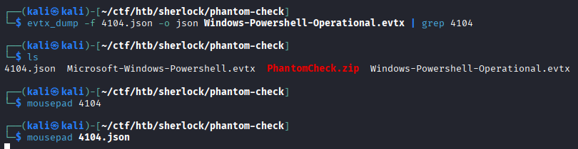
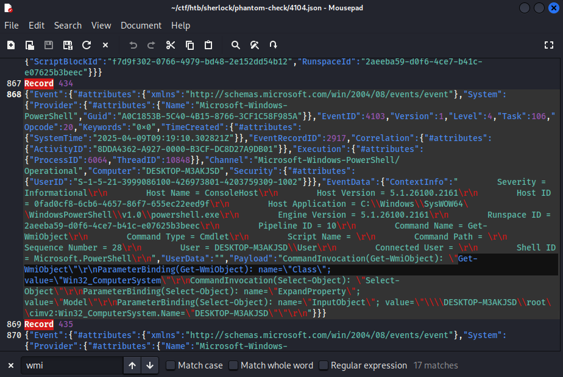
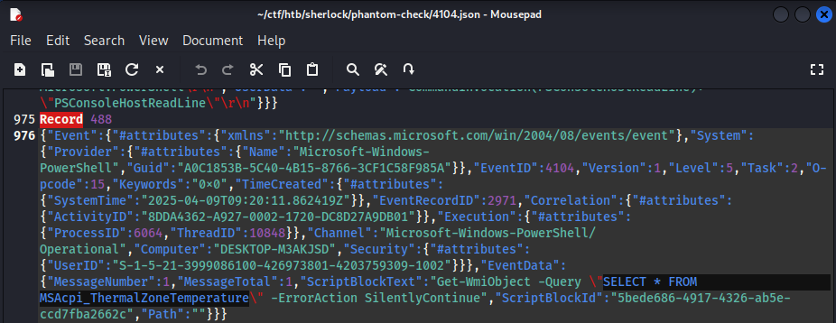
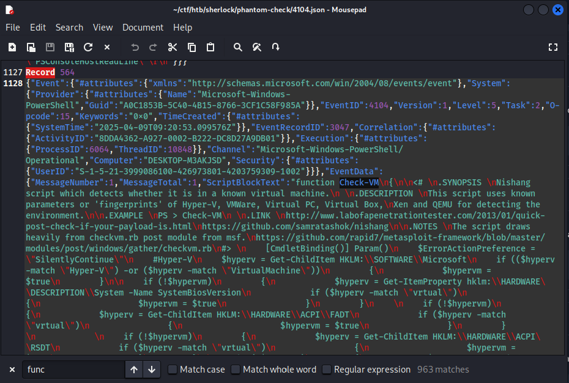
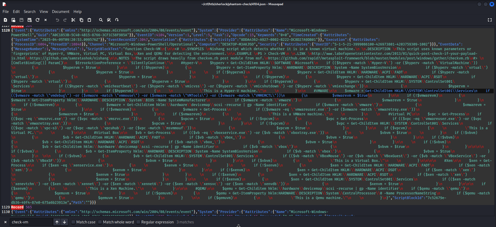
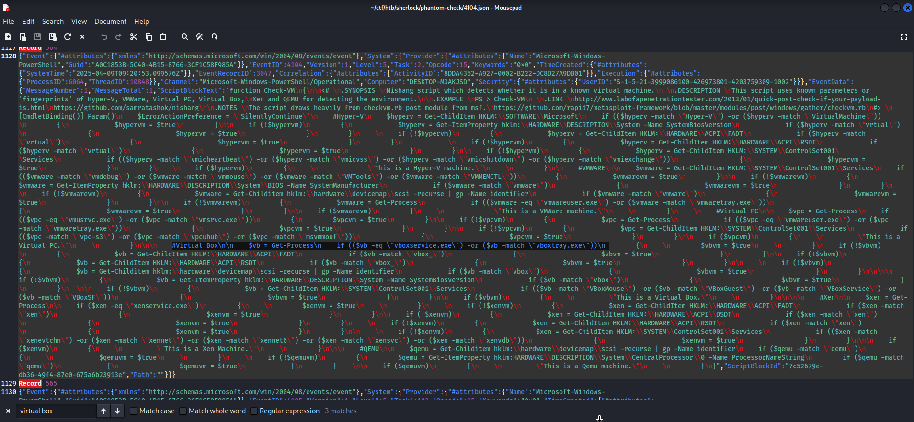
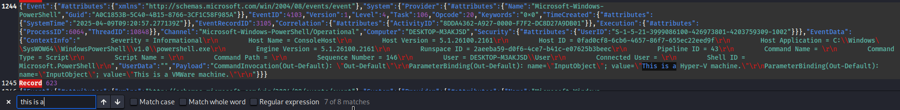
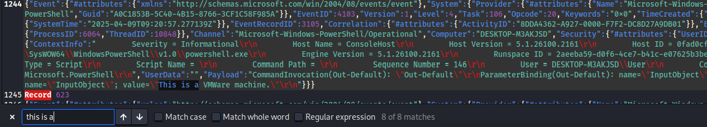

## Operation Blackout 2025: Phantom Check
### Description
Talion suspects that the threat actor carried out anti-virtualization checks to avoid detection in sandboxed environments. Your task is to analyze the event logs and identify the specific techniques used for virtualization detection. Byte Doctor requires evidence of the registry checks or processes the attacker executed to perform these checks.`  
**Tools:** evtx-dump, text editor  
**Author:** [violethat](https://app.hackthebox.com/users/22341)      
**Difficulty:** Very Easy  

### Walkthrough
We are provided with a zip file named **PhantomCheck.zip**. After extracting it, we find two `evtx` files. To begin the analysis, I dumped **Windows-Powershell-Operational.evtx** and filtered for Event ID 4104 using **grep** and **evtx_dump**.  
I focused on **Event ID 4104**, as it contains PowerShell script block logs, which are commonly used by attackers during execution.  
  
  

To identify the WMI class used by the attacker, I opened the dumped output in a text editor and searched for the keyword **wmi**.  
  
  

**Question 1**  
>**Which WMI class did the attacker use to retrieve model and manufacturer information for virtualization detection?**  

Answer: 
Win32_ComputerSystem
  

Near the previous result, I found a WMI query related to retrieving the system’s temperature.  
  
  

**Question 2**  
>**Which WMI query did the attacker execute to retrieve the current temperature value of the machine?**  

Answer: 
SELECT * FROM MSAcpi_ThermalZoneTemperature
  

Next, I searched for the keyword **"function"** to identify the PowerShell function used in the script. By reviewing the script and its comments, I located the function responsible for detecting virtual machines.  
  
  

**Question 3**  
>**The attacker loaded a PowerShell script to detect virtualization. What is the function name of the script?**  

Answer: 
Check-VM
  
  
Using the identified function name, I searched for related registry activity. The script repeatedly references a registry path used for virtualization detection.  
  
  
  
**Question 4**  
>**Which registry key did the above script query to retrieve service details for virtualization detection?**  

Answer: 
HKLM:\SYSTEM\ControlSet001\Services
  

The script also includes checks for VirtualBox. By searching for **VirtualBox**, I found conditional script comparing specific services.  
  
  

**Question 5**  
>**The VM detection script can also identify VirtualBox. Which processes is it comparing to determine if the system is running VirtualBox?**  

Answer: 
vboxservice.exe, vboxtray.exe
  

For the final task, the question provides a hint: the output includes the prefix **"This is a"**. Searching for this phrase reveals the virtualization platforms detected by the script.  
    
  
  
  

**Question 6**  
>**The VM detection script prints any detection with the prefix 'This is a'. Which two virtualization platforms did the script detect?**  

Answer: 
Hyper-V, Vmware
  
