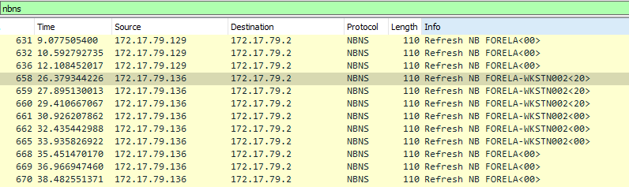
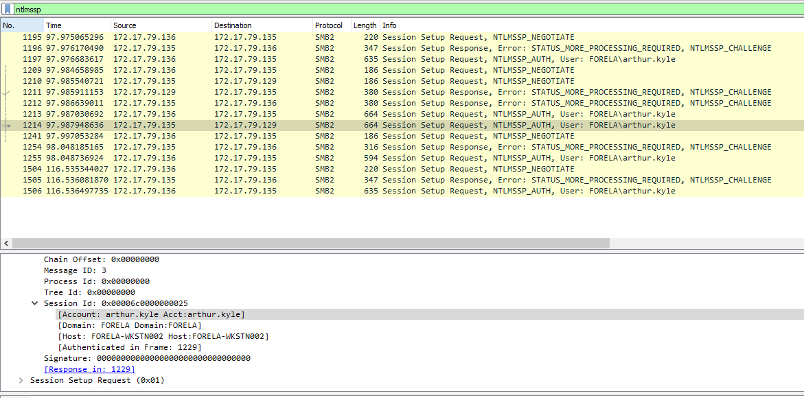
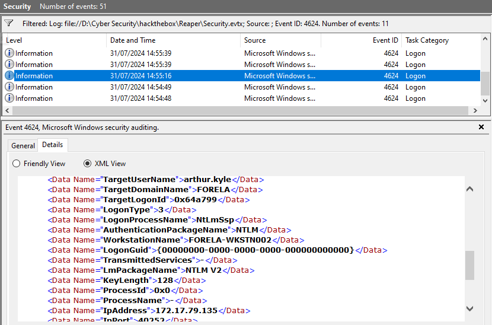
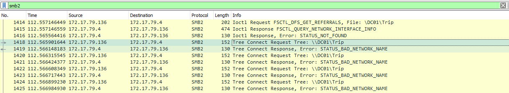
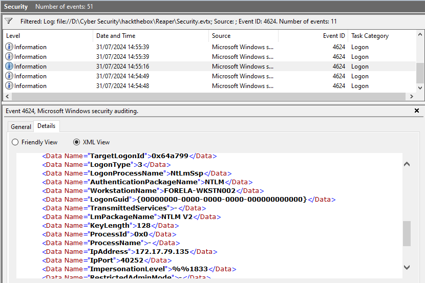
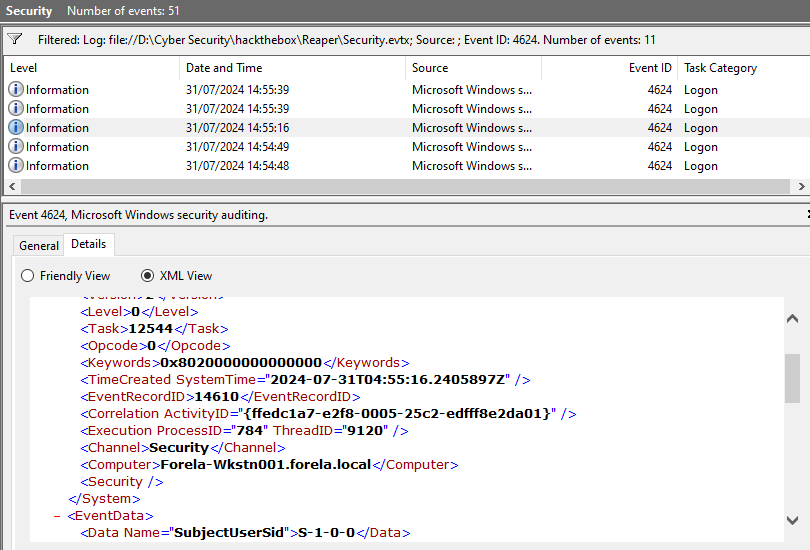
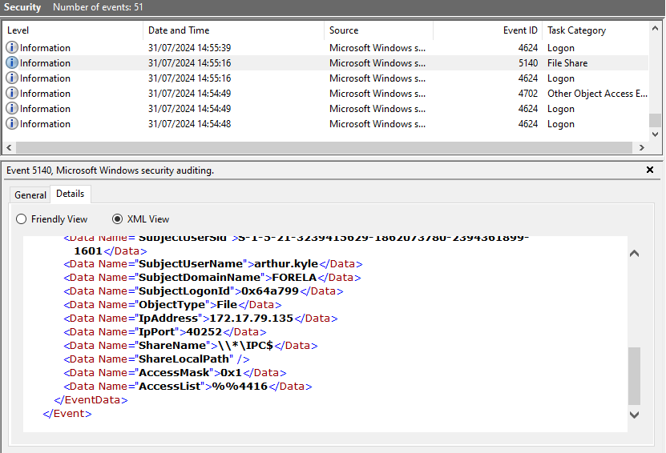

## Reaper
### Description
`Our SIEM alerted us to a suspicious logon event which needs to be looked at immediately . The alert details were that the IP Address and the Source Workstation name were a mismatch .You are provided a network capture and event logs from the surrounding time around the incident timeframe. Corelate the given evidence and report back to your SOC Manager.`  
**Tools:** Wireshark, Windows Event Viewer  
**Author:** CyberJunkie  
**Difficulty:** Very Easy  

### Walkthrough
We will receive a zip file named **Reaper.zip**. Upon unzipping the file, I found a pcapng file and an evtx file.  

Let's move on to the first question: we need to find the IP address of Forela-Wkstn001. To do this, we can examine the nbns protocol in **Wireshark**. Open the pcapng file in Wireshark and apply a filter for the nbns protocol. You'll see the name of the workstation, which is **FORELA-WKSTN001**. NBNS (NetBIOS Name Service) works like DNS by translating names to IP addresses.  

  

**Task 1**  
>Question: **What is the IP Address for Forela-Wkstn001?**  

Answer: 
172.17.79.129
  

Scroll down a bit, and you'll find the IP address for question 2.  

  

**Task 2**  
>Question: **What is the IP Address for Forela-Wkstn002?**  

Answer: 
172.17.79.136
  

Next, we need to find the user account whose hash was stolen by the attacker. We can filter the network traffic by 'ntlmssp' in **Wireshark**.  
NTLMSSP is a protocol used for NTLM challenge-response authentication, and it will display the user account information.  

  

**Task 3**  
>Question: **Which user account's hash was stolen by attacker?**  

Answer: 
arthur kyle
  

To identify an unknown device used by the attacker, we can examine the events using **Windows Event Viewer**.  
First, open the .evtx file in **Windows Event Viewer** to view the events.  
Then, filter by event ID 4624, which is used for logon events.  

  

**Task 4**  
>Question: **What is the IP Address of Unknown Device used by the attacker to intercept credentials?**  

Answer: 
172.17.79.135
  

The next task is to find the fileshare. We'll return to Wireshark and filter by the SMB2 protocol. We use this protocol because Samba (SMB) is commonly used for file sharing.  

  

**Task 5**  
>Question: **What was the fileshare navigated by the victim user account?**  

Answer: 
\\DC01\Trip
  

Returning to Event Viewer, we need to identify the malicious session used by the attacker to log in with the compromised account. Filter by event ID 4624 and examine the details of each event until you find a suspicious one.  

Once you find it, you'll be able to answer questions 7 and 8 as well.  

  

**Task 6**  
>Question: **What is the source port used to logon to target workstation using the compromised account?**  

Answer: 
40252
  

**Task 7**  
>Question: **What is the Logon ID for the malicious session?**  

Answer: 
0x64A799
  

**Task 8**  
>Question: **The detection was based on the mismatch of hostname and the assigned IP Address.What is the workstation name and the source IP Address from which the malicious logon occur?**  

Answer: 
FORELA-WKSTN002, 172.17.79.135
  

In the same event, the timestamp is located above the previous information.  

  

**Task 9**  
>Question: **When did the malicious logon happened. Please make sure the timestamp is in UTC?**  

Answer: 
2024-07-31 04:55:16
  

The last thing to discover is the share name. You can find this in the file share category in **Windows Event Viewer**.  

  

**Task 10**  
>Question: **What is the share Name accessed as part of the authentication process by the malicious tool used by the attacker?**  

Answer: 
\\*\IPC$
  
