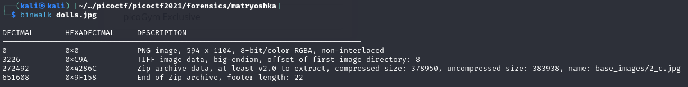
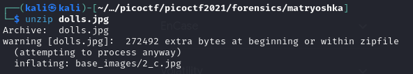
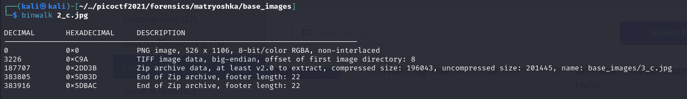
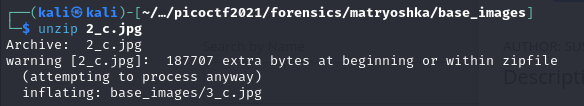
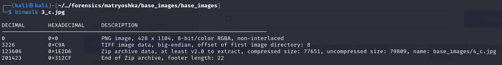
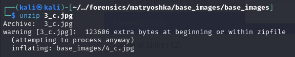
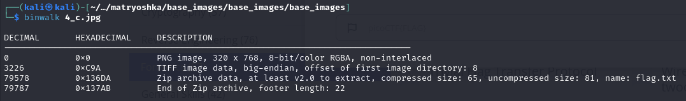
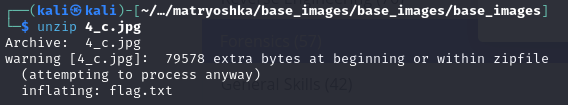

## Matryoshka Doll
### Description
Matryoshka dolls are a set of wooden dolls of decreasing size placed one inside another. What's the final one? Image: [this](https://mercury.picoctf.net/static/b6205dd933ec01c022c4e6acbdf11116/dolls.jpg)  
**Author:** SUSIE/PANDU  
**Flag Format:** picoCTF{FLAG}   
**Challenge Type:** Forensics  
**Point:** 30 points

### Hints

1
Wait, you can hide files inside files? But how do you find them?

2
Make sure to submit the flag as picoCTF{XXXXX}

### Walkthrough
We are provided with an image containing a hidden flag. Initially, I ran the **file** command from Linux to confirm whether the file was indeed an image or not. 

Once I was certain that the file was an image, I utilized **binwalk** for a thorough analysis. This tool not only uses in analysis but also in extracting data from binary files.

Before delving further into solving the challenge, I relied on only two tools: **binwalk** for file analysis and **unzip** for extracting files. Examining the image, I identified a compressed zip file ('base_images/2_c.jpg'). To decompress the data, the unzip command was executed.

After successfully extracting the file, a directory named 'base_images' was revealed, it has a file named '2_c.jpg'. To proceed with the analysis, I navigated into the folder using the **cd** command, and then continued analyzing the file using the **binwalk** command.

The output of the binwalk command indicated the presence of another compressed zip file. Consequently, I proceeded to unzip the new file ('2_c.jpg').

Next, I went inside the new directory and analysed the recently extracted file ('3_c.jpg').

Subsequently, I observed another file to be extracted ('4_c.jpg'). So, a third round of file extraction was needed.

After extracting the file again, an analysis of the file revealed a good news. The flag file was visible in this round.

Therefore, this was the last extraction using **unzip** command.

Finally, I used the **cat** command to read the flag file.

In summary, solving the challenge is just like opening a 'Matryoshka doll', where dolls are stacked inside one another. That's why we keep opening it the same way every time.  
  
It was a fun challenge :relaxed:
