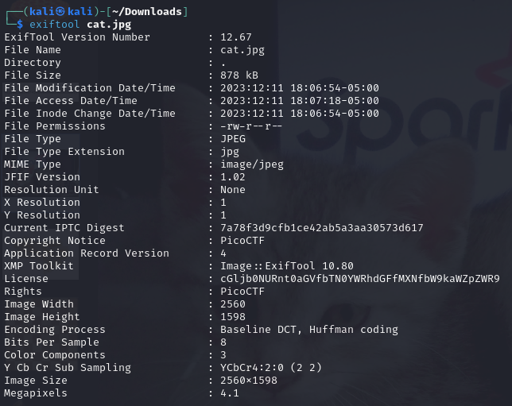
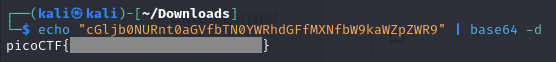

## Information
### Description
`Files can always be changed in a secret way. Can you find the flag?` [cat.jpg](https://mercury.picoctf.net/static/e5825f58ef798fdd1af3f6013592a971/cat.jpg)  
**Author:** SUSIE  
**Flag Format:** picoCTF{FLAG}   
**Challenge Type:** Forensics  
**Point:** 10 points

### Hints

1
Look at the details of the file

2
Make sure to submit the flag as picoCTF{XXXXX}

### Walkthrough
After downloading the **cat.jpg** file, the first thing I did was examine the details of the file. I used **exiftool** to help me analyse the image.

When I saw the license information, it looked like it had been encoded. Based on the signature of the string, it appears to be in base64 format. Therefore, I used the base64 command combined with echo to input the string into the base64 command. The final command is `echo "cGljb0NURnt0aGVfbTN0YWRhdGFfMXNfbW9kaWZpZWR9" | base64 -d`. After running this command, I was able to retrieve the flag.

