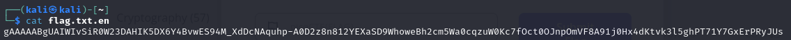
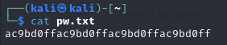
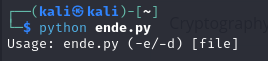
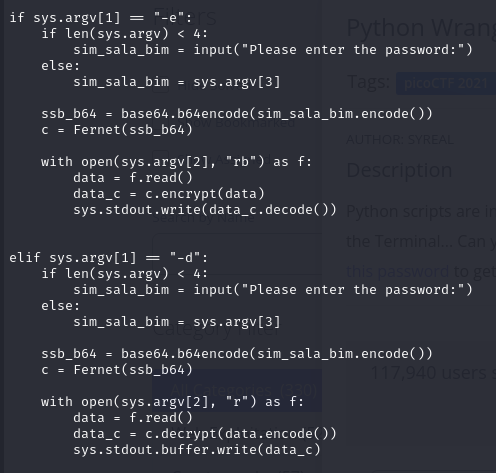
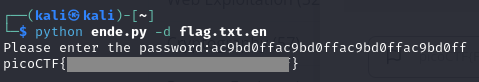

## Python Wrangling
### Description
Python scripts are invoked kind of like programs in the Terminal... Can you run [this Python script](https://mercury.picoctf.net/static/325a52d249be0bd3811421eacd2c877a/ende.py) using [this password](https://mercury.picoctf.net/static/325a52d249be0bd3811421eacd2c877a/pw.txt) to get [the flag](https://mercury.picoctf.net/static/325a52d249be0bd3811421eacd2c877a/flag.txt.en)?   
**Author:** SYREAL  
**Flag Format:** picoCTF{FLAG}   
**Challenge Type:** General Skills  
**Point:** 10 points

### Hints

1
Get the Python script accessible in your shell by entering the following command in the Terminal prompt: $ wget https://mercury.picoctf.net/static/325a52d249be0bd3811421eacd2c877a/ende.py

2
$ man python

### Walkthrough
We are given three files to solve the flag (ende.py, pw.txt, and flag.txt.en). We can guess the location of the flag file just by looking at the filename &rarr; **flag.txt.en**. When I saw the content of the flag file, it seemed that it was encrypted.  

That's why there is a password file, namely **pw.txt**.

To use both files, there is a Python file to decrypt the flag. The password will be used as the input of the program.  
After I tried to run **ende.py**, I found interesting information in the output. The output demonstrated how to use the program, and there are two options to run the script (-e/-d). 

Therefore, I investigated the contents of the Python file. I read the content using the **cat** command from Linux (`cat ende.py`). Based on my observation, the **-e** option is used for encryption and the **-d** option is used for decryption. The comparison can be seen in the **data_c** variable, respectively: `data_c = c.encrypt(data)` for encryption and `data_c = c.decrypt(data.encode())` for decryption.  

As we know the usage of the options, we can decrypt the flag by using the **-d** option.  
The full command to run the program is `python ende.py -d flag.txt.en`.  
When there is a prompt that says `Please enter the password:`, we can use the password that we have retrieved from **pw.txt**.  
Here is the flag that we obtained after the program ran correctly.  

