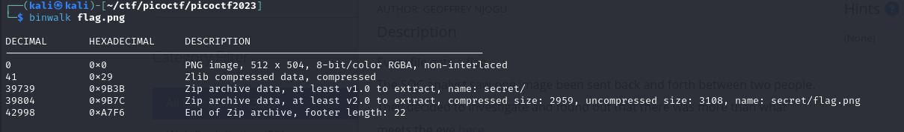
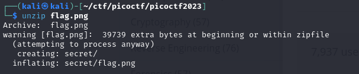
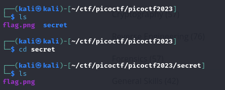
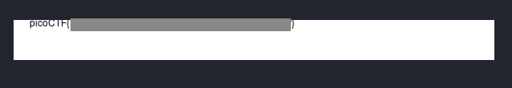

## hideme
### Description
`Every file gets a flag. The SOC analyst saw one image been sent back and forth between two people. They decided to investigate and found out that there was more than what meets the eye` [here](https://artifacts.picoctf.net/c/257/flag.png).  
**Author:** GEOFFREY NJOGU  
**Flag Format:** picoCTF{FLAG}   
**Challenge Type:** Forensics  
**Point:** 100 points

### Hints
(None)  

### Walkthrough
After the file was downloaded, I examined it and noticed that it was an image. Upon further investigation, it appeared to be a normal image.

![picoCTF][images/picoCTF.png]

The image needed to be analyzed more thoroughly using a tool named **binwalk**. The result revealed that the image contained a hidden folder, hidden using the zip method.  

Once unzipping the image, a secret folder containing a file emerged.  

Then, I examined the **flag.png** within the secret folder and the flag was discovered.  

